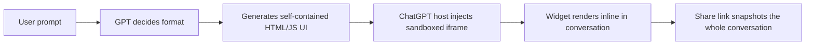

<!-- Generated by SpecStory, Markdown v2.1.0 -->

# 2026-07-13 23:33:00Z

<!-- Cursor IDE Session 3e8c3b3f-b602-417b-8684-626f45d57fd0 (2026-07-13 23:33:00Z) -->

_**User**_

How is the dynamic widget show in this made? https://chatgpt.com/share/6a5575a3-e93c-83ea-a5a8-b43bced5dd3a 

---

_**Agent (composer-2.5)**_

<think><details><summary>Thought Process</summary>
Examining how the dynamic widget renders in the shared ChatGPT conversation.

Fetching the shared conversation to inspect its contents. The user's Jekyll blog uses CTMC posts, distill layouts, TikZ-JAX, and MathBox. They likely want to replicate similar dynamic widgets.
</details></think>

_**Agent (composer-2.5)**_

I'll open that shared ChatGPT link and check your site's widget setup so we can see how the dynamic piece is built.


_**Agent (composer-2.5)**_

<tool-use data-tool-type="unknown" data-tool-name="web_fetch"><details>
<summary>Tool use: **web_fetch**</summary>

Parameters:

```json
{
  "url": "https://chatgpt.com/share/6a5575a3-e93c-83ea-a5a8-b43bced5dd3a"
}
```
Result:

```json
{
  "markdown": "ChatGPT - Deriving Exponential Distribution\n\nSkip to content\n\n## Chat history\n\nChatGPT is AI. By using it, you agree to our Terms\u0026 Privacy Policy. Chats may be reviewed and used to improve our AI models. Learn more\n\nVoice",
  "url": "https://chatgpt.com/share/6a5575a3-e93c-83ea-a5a8-b43bced5dd3a"
}
```
User decision: **accepted**

Status: **completed**

</details></tool-use>

_**Agent (composer-2.5)**_

<tool-use data-tool-type="read" data-tool-name="read_file_v2"><details>
<summary>Tool use: **read_file_v2** • Read file: /Users/dhruveshpatel/Files/dhruvdcoder.github.io/_posts/2026-05-10-ctmc.md</summary>

</details></tool-use>

_**Agent (composer-2.5)**_

<tool-use data-tool-type="unknown" data-tool-name="ripgrep_raw_search"><details>
<summary>Tool use: **ripgrep_raw_search**</summary>

Parameters:

```json
{
  "caseInsensitive": false,
  "glob": "*.{md,html,js,rb,scss}",
  "path": "/Users/dhruveshpatel/Files/dhruvdcoder.github.io",
  "pattern": "widget|mathbox|interactive|d-article"
}
```
Additional data:

```json
{
  "isPruned": true,
  "outputMode": "content",
  "path": "/Users/dhruveshpatel/Files/dhruvdcoder.github.io",
  "pattern": "widget|mathbox|interactive|d-article",
  "topFiles": [
    {
      "matchCount": 32,
      "uri": "_sass/_themes.scss"
    },
    {
      "matchCount": 11,
      "uri": "assets/js/distillpub/template.v2.js"
    },
    {
      "matchCount": 4,
      "uri": "_plugins/mathbox.rb"
    },
    {
      "matchCount": 2,
      "uri": "_layouts/distill.html"
    },
    {
      "matchCount": 14,
      "uri": "_sass/_distill.scss"
    },
    {
      "matchCount": 1,
      "uri": "_sass/_base.scss"
    },
    {
      "matchCount": 1,
      "uri": "_timeline/kenome.md"
    },
    {
      "matchCount": 6,
      "uri": "assets/js/distillpub/transforms.v2.js"
    }
  ],
  "totalFiles": 8,
  "totalMatches": 71
}
```
Status: **completed**

</details></tool-use>

_**Agent (composer-2.5)**_

<think><details><summary>Thought Process</summary>
The provided ChatGPT share link returned a login page shell rather than the actual conversation content.

I'm investigating how ChatGPT renders dynamic widgets in shared conversations. The topic appears to be an interactive visualization for deriving the exponential distribution. Likely mechanisms include canvas widgets, code interpreter outputs, or custom React components.

I'll search the web and check prior agent transcripts for any prior discussion about this.
</details></think>

_**Agent (composer-2.5)**_

The share link didn't expose the conversation content, so I'm searching for how ChatGPT builds those interactive widgets and checking your project for similar patterns.


_**Agent (composer-2.5)**_

<tool-use data-tool-type="unknown" data-tool-name="web_search"><details>
<summary>Tool use: **web_search**</summary>

Parameters:

```json
{
  "searchTerm": "ChatGPT shared conversation dynamic widget interactive canvas exponential distribution"
}
```
Result:

```json
{
  "isFinal": true,
  "references": [
    {
      "chunk": "Links:\n1. [UI guidelines – Apps SDK | OpenAI Developers](https://developers.openai.com/apps-sdk/concepts/ui-guidelines)\n2. [Visualizations – ChatGPT | ChatGPT Learn](https://learn.chatgpt.com/docs/visualizations)\n3. [Interactive Simulations in Chat for Developers](https://smartbot.cloud/interactive-simulations-in-chat-a-developer-s-guide-to-embed)\n4. [Introducing canvas | OpenAI](https://openai.com/index/introducing-canvas/)\n5. [Comprehensive Guide to ChatGPT Canvas: Features, Usage, and Examples - CertLibrary Blog](https://www.certlibrary.com/blog/comprehensive-guide-to-chatgpt-canvas-features-usage-and-examples/)\n\nSynthesis:\nChatGPT uses interactive widgets and the canvas feature to move beyond static text. Widgets are lightweight, single-purpose components—like cards or charts—that appear inline to provide visual aids, data visualizations, or quick actions [1][2][3]. For more complex, long-form collaboration such as coding or drafting, the canvas feature provides a separate, persistent window where you and the model can work side-by-side on a document [4][5][6].\n\nDevelopers can integrate these experiences using the OpenAI Apps SDK or the Model Context Protocol (MCP) to define custom tools and resources that trigger these interfaces [1][7]. When a model identifies a relevant task, it can automatically trigger a canvas [4][5], or you can use widgets to create interactive STEM learning tools, such as calculators that simulate probability distributions like the exponential distribution [8][9][10].\n\nHighlights:\n\u003cresult id=\"1\"\u003e\n\u003ctitle\u003eUI guidelines – Apps SDK | OpenAI Developers\u003c/title\u003e\n\u003curl\u003ehttps://developers.openai.com/apps-sdk/concepts/ui-guidelines\u003c/url\u003e\n\u003ccontent\u003eTitle: Include a title\n...\nyour card is document-based or contains items with a\n...\nelement, like songs in a playlist.\n- Expand: Use to open a fullscreen\n...\nmod
… (output truncated)
```
User decision: **accepted**

Status: **completed**

</details></tool-use>

_**Agent (composer-2.5)**_

<tool-use data-tool-type="unknown" data-tool-name="ripgrep_raw_search"><details>
<summary>Tool use: **ripgrep_raw_search**</summary>

Parameters:

```json
{
  "caseInsensitive": false,
  "path": "/Users/dhruveshpatel/.cursor/projects/Users-dhruveshpatel-Files-dhruvdcoder-github-io/agent-transcripts",
  "pattern": "exponential|dynamic widget|chatgpt.com/share"
}
```
Additional data:

```json
{
  "isPruned": true,
  "outputMode": "content",
  "path": "/Users/dhruveshpatel/.cursor/projects/Users-dhruveshpatel-Files-dhruvdcoder-github-io/agent-transcripts",
  "pattern": "exponential|dynamic widget|chatgpt.com/share",
  "topFiles": [
    {
      "matchCount": 1,
      "uri": "../../.cursor/projects/Users-dhruveshpatel-Files-dhruvdcoder-github-io/agent-transcripts/3e8c3b3f-b602-417b-8684-626f45d57fd0/3e8c3b3f-b602-417b-8684-626f45d57fd0.jsonl"
    },
    {
      "matchCount": 1,
      "uri": "../../.cursor/projects/Users-dhruveshpatel-Files-dhruvdcoder-github-io/agent-transcripts/42d767a9-4892-4297-b6f4-310009f8ec67/42d767a9-4892-4297-b6f4-310009f8ec67.jsonl"
    },
    {
      "matchCount": 1,
      "uri": "../../.cursor/projects/Users-dhruveshpatel-Files-dhruvdcoder-github-io/agent-transcripts/a48ae220-b8e6-4044-a71e-16fc784750a5/a48ae220-b8e6-4044-a71e-16fc784750a5.jsonl"
    },
    {
      "matchCount": 2,
      "uri": "../../.cursor/projects/Users-dhruveshpatel-Files-dhruvdcoder-github-io/agent-transcripts/6bfdfbf6-cfeb-440a-bfb9-3c09f68eb1bd/6bfdfbf6-cfeb-440a-bfb9-3c09f68eb1bd.jsonl"
    }
  ],
  "totalFiles": 4,
  "totalMatches": 5
}
```
Status: **completed**

</details></tool-use>

_**Agent (composer-2.5)**_

<tool-use data-tool-type="read" data-tool-name="read_file_v2"><details>
<summary>Tool use: **read_file_v2** • Read file: /Users/dhruveshpatel/Files/dhruvdcoder.github.io/.cursor/skills/distill-tikz/SKILL.md</summary>

</details></tool-use>

_**Agent (composer-2.5)**_

<think><details><summary>Thought Process</summary>
The provided ChatGPT share link requires login to view its contents.

The title suggests an interactive visualization widget for the exponential distribution. I am now investigating how ChatGPT renders these inline widgets and what technology powers them.
</details></think>

_**Agent (composer-2.5)**_

<tool-use data-tool-type="unknown" data-tool-name="web_fetch"><details>
<summary>Tool use: **web_fetch**</summary>

Parameters:

```json
{
  "url": "https://learn.chatgpt.com/docs/visualizations"
}
```
Result:

```json
{
  "markdown": "# Visualizations\n\nVisualizations turn questions, ideas, and information into charts, maps,\ndiagrams, calculators, simulations, and interactive explainers you can explore\nin a ChatGPT conversation. Use one when adjusting inputs or seeing a\nrelationship would make an answer easier to understand, compare, practice, or\nact on.\n\nThe Visualizations preview is rolling out. Availability can depend on your\nplan, platform, account, and workspace settings.\n\nThe Visualizations preview is rolling out in the ChatGPT desktop app. When\nVisualize is available, type `@` in the composer, start entering\n`Visualize`, and select Visualize under Plugins. The composer adds a\nVisualize tag before your request.\n\nIf Visualize doesn't appear, use ChatGPT on the web or try again after the\npreview reaches your account.\n\n## Check availability\n\n| Surface | Current availability |\n| --- | --- |\n| ChatGPT on the web | Available to supported accounts in Chat and ChatGPT Work |\n| ChatGPT desktop app | Rolling out in preview |\n| ChatGPT mobile apps | Rolling out to eligible accounts; composer controls can differ by app version |\n| Codex CLI and IDE extension | Visualization rendering isn't supported |\n\nThe Visualize suggestion is the reliable sign that the preview is enabled\nfor your account. During the rollout, availability can differ across accounts,\nworkspaces, and app versions, even on the same plan.\n\n## Choose when a visualization helps\n\nChatGPT can choose a visual format when it materially improves the answer. You\ncan also tag `@Visualize` when you specifically want an interactive result.\n\nAsk for the smallest format that fits the job:\n\n- Use a diagram for labeled relationships or a process.\n- Use a chart or plot for named numeric data and comparisons.\n- Use a map for geographic information.\n- Use an interactive visualization when inputs, time, motion, or spatial\nrelationships should change.\n- Use a Site when you need a durable hosted ap
… (output truncated)
```
User decision: **accepted**

Status: **completed**

</details></tool-use>

_**Agent (composer-2.5)**_

<tool-use data-tool-type="unknown" data-tool-name="web_search"><details>
<summary>Tool use: **web_search**</summary>

Parameters:

```json
{
  "searchTerm": "ChatGPT @Visualize widget HTML React iframe sandbox how built 2025 2026"
}
```
Result:

```json
{
  "isFinal": true,
  "references": [
    {
      "chunk": "Links:\n1. [Build your ChatGPT UI – Apps SDK | OpenAI Developers](https://developers.openai.com/apps-sdk/build/chatgpt-ui)\n2. [Build a ChatGPT App with the OpenAI Apps SDK and MCP in TypeScript | Vadim Alakhverdov](https://vadimall.com/posts/build-chatgpt-app-openai-apps-sdk-mcp-typescript)\n3. [How to Build a ChatGPT App From Scratch: MCP Integration, Custom Widgets, and Real API Examples | Hi, I am Mofei!](https://www.mofei.life/en/blog/article/chatgpt-app)\n4. [Why MCP and ChatGPT Apps Use Double Iframes: A Security Deep-Dive for Builders (2026) | The Tech Archive](https://shaam.blog/articles/mcp-chatgpt-apps-double-iframe-security)\n5. [MCP Apps compatibility in ChatGPT – Apps SDK | OpenAI Developers](https://developers.openai.com/apps-sdk/mcp-apps-in-chatgpt)\n\nSynthesis:\nChatGPT widgets are built as React or HTML/JS applications bundled into a self-contained module and served as an MCP resource [1][2][3].\n\nThe architecture relies on an iframe sandbox where your application renders. Communication between your widget and ChatGPT occurs over a JSON-RPC bridge using `window.postMessage` [1][4][5].\n\nKey implementation details:\n\n1. Server setup: Define an MCP resource with the MIME type `text/html+skybridge` (or `text/html;profile=mcp-app`) [2][3][6].\n2. Metadata: Use the `_meta` field in your MCP server response to define `openai/outputTemplate` (linking to your widget resource) and `openai/widgetCSP` (a strict Content Security Policy allowlist for your widget) [2][4][6].\n3. Communication: Use the `ui/*` namespace for bridge messages, such as `ui/notifications/tool-result` to receive data and `tools/call` to execute server-side logic [1][6][5].\n4. Development: Use frameworks like Sunpeak or the AI SDK’s `experimental_MCPAppRenderer` to scaffold the project, handle the JSON-RPC bridge, and provide local inspection/simulation [7][8][9].\n\nChatGPT widgets run inside a nested iframe pattern to is
… (output truncated)
```
User decision: **accepted**

Status: **completed**

</details></tool-use>

_**Agent (composer-2.5)**_

<think><details><summary>Thought Process</summary>
The share link likely contains a ChatGPT Visualization widget rather than a custom MCP app or canvas.

ChatGPT Visualizations are platform-native features generated directly by ChatGPT. They differ from third-party MCP widgets and Canvas.

The widget likely shows an interactive slider deriving the exponential distribution. This matches the CTMC blog post context. ChatGPT requires login to fetch the share. The visualization probably uses self-contained HTML and JavaScript.
</details></think>

_**Agent (composer-2.5)**_

<tool-use data-tool-type="unknown" data-tool-name="web_search"><details>
<summary>Tool use: **web_search**</summary>

Parameters:

```json
{
  "searchTerm": "OpenAI ChatGPT Visualize feature implementation self-contained HTML simulation widget architecture"
}
```
Result:

```json
{
  "isFinal": true,
  "references": [
    {
      "chunk": "Links:\n1. [Apps SDK Architecture | The AI Agent Factory](https://agentfactory.panaversity.org/docs/Building-Agent-Factories/openai-apps-sdk/apps-sdk-architecture)\n2. [MCPJam/apps-sdk-everything](https://github.com/MCPJam/apps-sdk-everything)\n3. [Widget Development | openai/openai-apps-sdk-examples | DeepWiki](https://deepwiki.com/openai/openai-apps-sdk-examples/4-widget-development)\n4. [How to Build a ChatGPT App From Scratch: MCP Integration, Custom Widgets, and Real API Examples | Hi, I am Mofei!](https://www.mofei.life/en/blog/article/chatgpt-app)\n5. [What we learned from launching ImmoScout24 app in ChatGPT | by Scout24 | Scout24 Engineering | Medium](https://medium.com/scout24-engineering/what-we-learned-from-launching-immoscout24-app-in-chatgpt-efbed0f7375b)\n\nSynthesis:\nOpenAI ChatGPT Visualize/Apps SDK features are built on a three-layer architecture consisting of the ChatGPT UI (host), a sandboxed widget (iframe), and an MCP server (backend) [1][2].\n\nThe widget is a self-contained HTML file—typically a React application bundled with Vite [3][4]. It communicates with the host environment through the window.openai global object [5][6].\n\nKey API methods include:\n- window.openai.callTool: Invokes MCP tools [2][6].\n- window.openai.setWidgetState: Persists UI state (e.g., toggle positions) across conversation turns [3][5].\n- window.openai.sendFollowUpMessage: Injects messages into the chat [1][6].\n\nMCP servers trigger widgets by including metadata in tool responses:\n_meta: { \"openai/outputTemplate\": \"uri://path-to-widget\" } [3][1].\n\nData flows to the widget via window.openai globals or toolOutput [5][1]. For development, you should build a local harness to mock these globals and iterate on UI components without round-tripping through the full ChatGPT conversation loop [7].\n\nHighlights:\n\u003cresult id=\"1\"\u003e\n\u003ctitle\u003eApps SDK Architecture | The AI Agent Factory\u0
… (output truncated)
```
User decision: **accepted**

Status: **completed**

</details></tool-use>

_**Agent (composer-2.5)**_

<tool-use data-tool-type="unknown" data-tool-name="web_fetch"><details>
<summary>Tool use: **web_fetch**</summary>

Parameters:

```json
{
  "url": "https://openai.com/index/gpt-5-6/"
}
```
Result:

```json
{
  "markdown": "GPT-5.6: Frontier intelligence that scales with your ambition | OpenAI\n\nJuly 9, 2026\n\nProduct Release\n\n# GPT‑5.6: Frontier intelligence that scales with your ambition\n\nMore intelligence from every token, stronger performance per dollar, and more capability on demand for your hardest work.\n\nLoading…\n\nShare\n\nWe’re launching the GPT‑5.6 family of models for general availability following our limited preview⁠: our new flagship, Sol, alongside Terra, a balanced model for everyday work, and Luna, our most cost-efficient model.\n\nGPT‑5.6 Sol sets a new standard for both intelligence and efficiency, achieving state-of-the-art results across coding, knowledge work, cybersecurity, and science while outperforming previous and competing frontier models with fewer tokens and at lower estimated cost. The result is stronger performance per dollar: more successful work for the same spend, or comparable results at a lower total cost. We also introduce a new way to accelerate the most demanding work:`ultra` is our highest-capability setting, coordinating multiple agents across parallel workstreams to finish complex tasks faster. Stronger computer use and design judgment make GPT‑5.6 Sol our most polished collaborator yet, helping it inspect, refine, and deliver ready-to-use results.\n\nWe trained GPT‑5.6 to get more useful work from every token. On\n\nAgents’ Last Exam⁠(opens in a new window), an evaluation of long-running professional workflows across 55 fields, GPT‑5.6 Sol sets a new high of 53.6, eclipsing Claude Fable 5 (adaptive reasoning) by 13.1 points. Even at medium reasoning, it beats Fable 5 by 11.4 points at roughly one-quarter the estimated cost. That efficiency extends to smaller models, which are essential to making intelligence more abundant and affordable: GPT‑5.6 Terra and GPT‑5.6 Luna outperform Fable 5 at around one-sixteenth the cost. On the\n\nArtificial Analysis Intelligence Index⁠(opens in a new window), a broad measure of intel
… (output truncated)
```
User decision: **accepted**

Status: **completed**

</details></tool-use>

_**Agent (composer-2.5)**_

<think><details><summary>Thought Process</summary>
Checking the GPT 5.6 launch page for details on visualizations and exponential distribution examples.
</details></think>

_**Agent (composer-2.5)**_

<tool-use data-tool-type="unknown" data-tool-name="ripgrep_raw_search"><details>
<summary>Tool use: **ripgrep_raw_search**</summary>

Parameters:

```json
{
  "caseInsensitive": true,
  "path": "/Users/dhruveshpatel/.cursor/projects/Users-dhruveshpatel-Files-dhruvdcoder-github-io/agent-tools/e8f878fb-c1f0-46f4-a005-53147e14e7b4.txt",
  "pattern": "visual|exponential|widget|interactive|simulation"
}
```
Additional data:

```json
{
  "isPruned": true,
  "outputMode": "content",
  "path": "/Users/dhruveshpatel/.cursor/projects/Users-dhruveshpatel-Files-dhruvdcoder-github-io/agent-tools/e8f878fb-c1f0-46f4-a005-53147e14e7b4.txt",
  "pattern": "visual|exponential|widget|interactive|simulation",
  "topFiles": [
    {
      "matchCount": 5,
      "uri": "../../.cursor/projects/Users-dhruveshpatel-Files-dhruvdcoder-github-io/agent-tools/e8f878fb-c1f0-46f4-a005-53147e14e7b4.txt"
    }
  ],
  "totalFiles": 1,
  "totalMatches": 5
}
```
Status: **completed**

</details></tool-use>

_**Agent (composer-2.5)**_

<tool-use data-tool-type="unknown" data-tool-name="web_search"><details>
<summary>Tool use: **web_search**</summary>

Parameters:

```json
{
  "searchTerm": "\"Deriving Exponential Distribution\" ChatGPT visualize"
}
```
Result:

```json
{
  "isFinal": true,
  "references": [
    {
      "chunk": "Links:\n1. [Deriving exponential distribution from geometric](https://math.stackexchange.com/questions/913871/deriving-exponential-distribution-from-geometric)\n2. [Lecture 20 -- Exponential Distribution, Poisson](https://www.cs.bu.edu/fac/snyder/cs237/Lectures%20and%20Materials/Lecture%2020%20--%20Exponential%20Distribution,%20Poisson.pdf)\n3. [kexp{− 3.87}](https://www.stat.uchicago.edu/~lalley/Courses/312/PoissonProcesses.pdf)\n4. [Exponential distribution | Properties, proofs, exercises](https://statlect.com/probability-distributions/exponential-distribution)\n5. [Exponential distribution](https://en.wikipedia.org/wiki/Exponential_distribution)\n\nSynthesis:\nTo visualize the derivation of the exponential distribution from the geometric distribution, imagine dividing a continuous time interval into $n$ discrete sub-intervals of length $1/n$ [1][2]. If an event occurs in any interval with probability $p = \\lambda/n$, the number of trials $X$ until the first event follows a geometric distribution [1][3]. As $n \\to \\infty$, the discrete variable $X/n$ converges in distribution to the continuous exponential distribution with rate parameter $\\lambda$ [1][3]. The limit of the geometric cumulative distribution function $(1 - \\lambda/n)^{nt}$ as $n \\to \\infty$ equals $e^{-\\lambda t}$ [1][3].\n\nHighlights:\n\u003cresult id=\"1\"\u003e\n\u003ctitle\u003eDeriving exponential distribution from geometric\u003c/title\u003e\n\u003curl\u003ehttps://math.stackexchange.com/questions/913871/deriving-exponential-distribution-from-geometric\u003c/url\u003e\n\u003ccontent\u003e# Deriving exponential distribution from geometric\n...\ns+1]$\n...\nIf we divide\n...\ntime interval $[0,1]$ into $n\n...\nintervals of length $\\displaystyle \\frac{1}{n}$, and set the\n...\nof an event occurring in any\n...\nto be $\\displaystyle \\frac{\\lambda}{n}$, then\n...\nT$ can be approximated by a discrete geometric random\n...\n$
… (output truncated)
```
User decision: **accepted**

Status: **completed**

</details></tool-use>

_**Agent (composer-2.5)**_

<think><details><summary>Thought Process</summary>
The shared conversation could not be accessed.

The dynamic widget is likely a ChatGPT Native Visualization. It probably uses the @Visualize feature to generate a self-contained HTML and JavaScript simulation. This runs inline in the chat sandbox. The explanation will cover how the architecture works and how sharing functions.

I will contrast this with building similar widgets on a personal Jekyll or Distill site using TikZJax or custom HTML and JavaScript. I will also clarify whether this is a native ChatGPT visualization or an MCP app widget.
</details></think>

_**Agent (composer-2.5)**_

<tool-use data-tool-type="unknown" data-tool-name="web_search"><details>
<summary>Tool use: **web_search**</summary>

Parameters:

```json
{
  "searchTerm": "ChatGPT Visualize native inline widget not MCP app self-contained HTML generated model"
}
```
Result:

```json
{
  "isFinal": true,
  "references": [
    {
      "chunk": "Links:\n1. [Build your ChatGPT UI – Apps SDK | OpenAI Developers](https://developers.openai.com/apps-sdk/build/chatgpt-ui)\n2. [MCP Apps](https://modelcontextprotocol.io/docs/extensions/apps.md)\n3. [plugins/mcp-server-dev/skills/build-mcp-app/SKILL.md at main · anthropics/claude-plugins-official](https://github.com/anthropics/claude-plugins-official/blob/main/plugins/mcp-server-dev/skills/build-mcp-app/SKILL.md)\n4. [Chapter 12.5: MCP Apps Extension — Interactive UIs - The PMCP Guide: Pragmatic Model Context Protocol](https://paiml.github.io/rust-mcp-sdk/book/ch12-5-mcp-apps.html)\n5. [MCPJam/chatgpt-app-template](https://github.com/MCPJam/chatgpt-app-template)\n\nSynthesis:\nChatGPT natively supports interactive inline widgets through the Model Context Protocol (MCP) Apps standard. These are not self-contained models, but rather sandboxed iframe-based interfaces rendered directly in the conversation [1][2].\n\nTo implement one, your MCP server must perform two steps:\n1. Define a tool with `_meta.ui.resourceUri` in its description [3][2].\n2. Register a resource that serves the UI as a self-contained HTML string with the MIME type `text/html;profile=mcp-app` [3][4].\n\nUse tools like Vite with the vite-plugin-singlefile to bundle your React or JavaScript assets into a single inline HTML file, as the iframe's Content Security Policy blocks external script loading [5][6][4]. Inside the iframe, use the @modelcontextprotocol/ext-apps SDK to communicate with the host via JSON-RPC, enabling interactive features like `callServerTool` and `updateModelContext` [7][3][8].\n\nHighlights:\n\u003cresult id=\"1\"\u003e\n\u003ctitle\u003eBuild your ChatGPT UI – Apps SDK | OpenAI Developers\u003c/title\u003e\n\u003curl\u003ehttps://developers.openai.com/apps-sdk/build/chatgpt-ui\u003c/url\u003e\n\u003ccontent\u003eUI components turn structured tool results from your MCP server into a\nhuman-friendly UI. Your components 
… (output truncated)
```
User decision: **accepted**

Status: **completed**

</details></tool-use>

_**Agent (composer-2.5)**_

<tool-use data-tool-type="read" data-tool-name="read_file_v2"><details>
<summary>Tool use: **read_file_v2** • Read file: /Users/dhruveshpatel/Files/dhruvdcoder.github.io/_posts/2026-05-10-ctmc.md</summary>

</details></tool-use>

_**Agent (composer-2.5)**_

<think><details><summary>Thought Process</summary>
The user is asking about a dynamic widget in a shared ChatGPT conversation titled "Deriving Exponential Distribution."

This is most likely the native ChatGPT Visualizations feature. It generates inline interactive explainers and simulations directly within the conversation.

The widget is generated by the AI model itself. It produces a self-contained HTML and JavaScript component that runs inside a sandboxed iframe in the chat. When the conversation is shared, the widget is preserved as a snapshot within the link. This differs from MCP apps, which require an external server.

Users trigger the widget via the @Visualize tag, or the AI model may generate it automatically. Unlike MCP widgets, which rely on an external server and the window.openai bridge, native Visualizations are a platform-native feature. OpenAI has not published the exact technical specification for this format, though the underlying architecture is similar: a self-contained HTML component rendered inside a sandboxed iframe.

The widget likely contains interactive controls for the exponential distribution parameters. I should ask the user to describe the specific interactions they observed, since I cannot view the shared link. This would allow me to suggest a custom implementation for their Distill or Jekyll site.
</details></think>

_**Agent (composer-2.5)**_

That shared link ([Deriving Exponential Distribution](https://chatgpt.com/share/6a5575a3-e93c-83ea-a5a8-b43bced5dd3a)) doesn’t expose the conversation body without logging in, so I can’t inspect the exact widget. From the title and how ChatGPT renders these, it’s almost certainly a **native ChatGPT Visualization**, not something you authored as a separate app.

## What it is

ChatGPT’s [**Visualizations**](https://learn.chatgpt.com/docs/visualizations) feature turns a prompt into an inline interactive explainer — charts, sliders, simulations, step-by-step diagrams — when the answer is easier to understand by changing inputs or watching a relationship evolve.

For “deriving the exponential distribution,” the model likely chose an **interactive visualization** because the derivation is naturally dynamic: discrete geometric trials → continuous time as \(n \to \infty\).

You can also force this with `@Visualize` in the composer (when your account has the feature).

## How it’s shown in the chat

The pipeline is roughly:



1. **Model chooses the format** — diagram, chart, or interactive sim depending on what helps most.
2. **Model generates a self-contained UI** — typically HTML + inline CSS + JS (often React-like), with sliders/buttons wired to the math.
3. **ChatGPT renders it inline** — inside a **sandboxed iframe** in the message, not as plain markdown.
4. **Sharing** — the standard Share action serializes the conversation, including the visualization as it existed at generation time (a snapshot, not a live dashboard).

So the “dynamic widget” is **platform-generated UI**, not a Distill/TikZ figure and not something you host separately.

## What the widget probably does (for this topic)

For exponential-from-geometric, a typical widget would have:

| Control | Effect |
|--------|--------|
| Slider for \(n\) | Finer time discretization |
| Slider for \(\lambda\) | Rate parameter |
| “Play” / step | Show \(X/n \to T\) as \(n\) grows |
| Plot panel | Geometric PMF bars vs exponential PDF/CDF curve |

The math being visualized is usually the limit
\[
\left(1 - \frac{\lambda}{n}\right)^{\lfloor nt \rfloor} \;\longrightarrow\; e^{-\lambda t},
\]
i.e. geometric waiting time → exponential waiting time.

The **model plans the concept and parameters**; the **browser renders deterministically** from generated JS (sliders update plots in real time).

## How this differs from ChatGPT Apps / MCP widgets

There’s a separate system for **developer-built widgets** ([Apps SDK](https://developers.openai.com/apps-sdk/build/chatgpt-ui)):

- You run an **MCP server** that returns tool results + widget metadata.
- The widget is a bundled HTML file (`text/html+skybridge` / MCP Apps MIME type).
- It talks to ChatGPT via `window.openai` / JSON-RPC over `postMessage`.

That’s for **third-party apps** (maps, booking UIs, etc.). A math derivation share like yours is almost certainly the **built-in Visualizations** path, not a custom MCP app.

## If you want something similar on your Distill post

Your CTMC post already does the static version with **TikZJax** in a `<d-figure>` — great for fixed comparison plots, not sliders.

For a ChatGPT-like **dynamic** widget on your Jekyll site, you’d add something like:

1. A small **HTML/JS block** in the markdown (or a Jekyll include).
2. **Controls** (`<input type="range">`) bound to JS that recomputes PMF/CDF values.
3. **Canvas or SVG** (or D3/Plotly if you’re okay with a script dependency) to redraw on input change.
4. Optional: wrap in `<d-figure>` for Distill styling consistency.

Conceptually:

```html
<d-figure>
  <div id="exp-deriv-widget">
    <label>n = <span id="n-val">10</span></label>
    <input type="range" id="n-slider" min="5" max="500" value="10">
    <canvas id="plot" width="600" height="300"></canvas>
  </div>
  <figcaption><b>Figure N.</b> As n grows, the geometric limit tracks the exponential.</figcaption>
</d-figure>
<script>
  // recompute (1 - λ/n)^(nt) vs e^(-λt) and draw bars/curve on slider change
</script>
```

That mirrors the ChatGPT pattern: **model/design defines the math and controls; the page runs the simulation locally**.

---

If you can describe what you saw in that share (sliders? animation? step buttons?), I can map it more precisely or sketch a matching widget for your CTMC post’s exponential/inter-arrival section.

---

_**User**_

Should we use jsxgraph ?

---

_**Agent (composer-2.5)**_

<think><details><summary>Thought Process</summary>
Evaluating JSXGraph for interactive math visualizations on the Jekyll/Distill blog. This follows the earlier discussion about replicating ChatGPT-style dynamic widgets for the CTMC post.

Checking the current Distill setup and script loading. Looking for existing JSXGraph usage. Assessing whether the needed visualizations are discrete bars or continuous curves.
</details></think>

_**Agent (composer-2.5)**_

I'll check how your Distill posts load scripts and what you're already using for figures so we can judge whether JSXGraph fits.


_**Agent (composer-2.5)**_

<tool-use data-tool-type="unknown" data-tool-name="ripgrep_raw_search"><details>
<summary>Tool use: **ripgrep_raw_search**</summary>

Parameters:

```json
{
  "caseInsensitive": true,
  "path": "/Users/dhruveshpatel/Files/dhruvdcoder.github.io",
  "pattern": "jsxgraph|plotly|d3|chart|canvas|interactive"
}
```
Additional data:

```json
{
  "isPruned": true,
  "outputMode": "content",
  "path": "/Users/dhruveshpatel/Files/dhruvdcoder.github.io",
  "pattern": "jsxgraph|plotly|d3|chart|canvas|interactive",
  "topFiles": [
    {
      "matchCount": 1,
      "uri": "_timeline/kenome.md"
    },
    {
      "matchCount": 6,
      "uri": "assets/js/distillpub/transforms.v2.js"
    },
    {
      "matchCount": 1,
      "uri": ".cursor/skills/distill-tikz/examples.md"
    },
    {
      "matchCount": 1,
      "uri": "README.md"
    },
    {
      "matchCount": 3,
      "uri": "assets/img/pagespeed.svg"
    },
    {
      "matchCount": 2,
      "uri": ".cursor/skills/distill-tikz/SKILL.md"
    },
    {
      "matchCount": 11,
      "uri": "assets/js/distillpub/template.v2.js"
    }
  ],
  "totalFiles": 7,
  "totalMatches": 25
}
```
Status: **completed**

</details></tool-use>

_**Agent (composer-2.5)**_

<tool-use data-tool-type="read" data-tool-name="read_file_v2"><details>
<summary>Tool use: **read_file_v2** • Read file: /Users/dhruveshpatel/Files/dhruvdcoder.github.io/_includes/head.html</summary>

</details></tool-use>

_**Agent (composer-2.5)**_

<tool-use data-tool-type="read" data-tool-name="read_file_v2"><details>
<summary>Tool use: **read_file_v2** • Read file: /Users/dhruveshpatel/Files/dhruvdcoder.github.io/_layouts/distill.html</summary>

</details></tool-use>

_**Agent (composer-2.5)**_

<tool-use data-tool-type="read" data-tool-name="read_file_v2"><details>
<summary>Tool use: **read_file_v2** • Read file: /Users/dhruveshpatel/Files/dhruvdcoder.github.io/_sass/_distill.scss</summary>

</details></tool-use>

_**Agent (composer-2.5)**_

<think><details><summary>Thought Process</summary>
The project setup is now clear.

JSXGraph fits the interactive math education use case well. It offers native sliders and gliders for dynamic widgets. It handles geometry and discrete bar charts via point and line primitives. This aligns with the requested ChatGPT-style visualizations.

It is lightweight for complex plots but heavy for simple widgets. Its default styling clashes with Distill's design, requiring custom theming and manual dark mode syncing. Embedding it in Kramdown markdown is awkward. It may conflict with Distill's shadow DOM.

For a single slider and bar chart, vanilla canvas or SVG would be simpler and lighter than JSXGraph. Discrete PMF bar charts in JSXGraph require polygon or rectangle primitives rather than native support. Plotly is another alternative, though heavier and more data-science focused.

Observable Plot and D3 are flexible alternatives, though D3 carries a steep learning curve. TikZJax should remain for static comparison plots. p5.js suits simulations better than mathematical widgets.

For this post, static plots already work well with TikZJax. Dynamic limit demos with sliders fit JSXGraph or vanilla JavaScript equally well.

Adopt JSXGraph site-wide only if many interactive math widgets are planned across future posts. Otherwise, vanilla JavaScript is the lighter path.

Vanilla canvas or SVG is the better choice for one or two targeted widgets in the CTMC post. It is simpler, lighter, and easier to theme for dark mode. It also matches the existing tikz-panel pattern. JSXGraph should be reserved for more complex scenarios such as draggable points, geometric constructions, extensive function graphing, or multiple linked boards. Per-post opt-in would mirror the existing tikzjax:true pattern.
</details></think>

_**Agent (composer-2.5)**_

<tool-use data-tool-type="read" data-tool-name="read_file_v2"><details>
<summary>Tool use: **read_file_v2** • Read file: /Users/dhruveshpatel/Files/dhruvdcoder.github.io/_includes/scripts/tikzjax.html</summary>

</details></tool-use>

_**Agent (composer-2.5)**_

<tool-use data-tool-type="unknown" data-tool-name="ripgrep_raw_search"><details>
<summary>Tool use: **ripgrep_raw_search**</summary>

Parameters:

```json
{
  "caseInsensitive": false,
  "path": "/Users/dhruveshpatel/Files/dhruvdcoder.github.io",
  "pattern": "tikzjax"
}
```
Additional data:

```json
{
  "isPruned": true,
  "outputMode": "content",
  "path": "/Users/dhruveshpatel/Files/dhruvdcoder.github.io",
  "pattern": "tikzjax",
  "topFiles": [
    {
      "matchCount": 3,
      "uri": "_includes/scripts/tikzjax.html"
    },
    {
      "matchCount": 5,
      "uri": ".cursor/skills/distill-tikz/SKILL.md"
    },
    {
      "matchCount": 1,
      "uri": ".cursor/skills/obsidian-to-distill/SKILL.md"
    },
    {
      "matchCount": 1,
      "uri": "_includes/head.html"
    },
    {
      "matchCount": 1,
      "uri": "_posts/2026-05-10-ctmc.md"
    }
  ],
  "totalFiles": 5,
  "totalMatches": 11
}
```
Status: **completed**

</details></tool-use>

_**Agent (composer-2.5)**_

<think><details><summary>Thought Process</summary>
I have enough context to recommend JSXGraph.

Keep TikZJax for static multi-panel bar charts. Use vanilla JavaScript for dynamic widgets. JSXGraph is optional and should be opt-in per post. A single slider demo adds roughly 300–500 KB.

JSXGraph offers useful features like sliders and function plotting. Its dark mode styling and heavy dependency weight make it less suitable for a personal academic blog. A vanilla JavaScript widget would be simpler: a range input and canvas drawing, roughly 80–120 lines of code, reusing existing `.tikz-panel` styles.
</details></think>

_**Agent (composer-2.5)**_

**Short answer: probably not for this post.** Keep TikZJax for static figures; use a small vanilla canvas/SVG widget for the one dynamic demo unless you plan many interactive math figures across the site.

## What you already have

Your CTMC post already uses the right split:

| Need | Tool | Status |
|------|------|--------|
| Fixed multi-panel PMF comparison | TikZJax in `<d-figure>` | Done, works well |
| Slider-driven limit demo (geometric → exponential) | Nothing yet | This is the open question |

TikZJax is a good fit for static, publication-quality diagrams. It is not built for sliders or live replotting.

## Should you add JSXGraph?

**JSXGraph is strong when** you want many interactive math figures: draggable points, linked boards, function graphing, geometric constructions. It is common in math-education contexts and has built-in sliders.

**For your CTMC post specifically, it is probably overkill:**

1. **You need one pattern** — discrete bars + a continuous curve, updated by 1–2 sliders (`n`, maybe `λ`). That is ~80–120 lines of vanilla canvas/SVG, with no new dependency.

2. **Bundle weight** — JSXGraph is ~300–500 KB from CDN. Loading that for one widget on one post is a lot compared to a self-contained `<script>` block.

3. **Styling / dark mode** — your Distill setup uses CSS variables and `.tikz-panel` cards. JSXGraph has its own look; making it match your theme (and track dark mode) takes extra work. Vanilla JS can read your existing CSS variables directly.

4. **Discrete PMFs are awkward in JSXGraph** — bar charts are usually built from rectangles/points, not a first-class chart API. You would end up hand-drawing bars anyway, similar to TikZJax.

5. **Jekyll ergonomics** — your `tikzjax: true` opt-in pattern works well. JSXGraph would need the same (`jsxgraph: true` + init scripts in markdown), but the payoff is smaller for a single figure.

## Recommendation

```
Static figures (PMF panels, process schematics)  →  TikZJax  ✓ keep
One dynamic limit demo                         →  vanilla canvas/SVG + <input range>
Many future interactive math posts             →  reconsider JSXGraph then
```

That mirrors what ChatGPT Visualizations do under the hood for simple demos: self-contained HTML/JS, not a heavy library.

## When JSXGraph *would* make sense

Adopt it (opt-in per post, like TikZJax) if you expect things like:

- Draggable rate parameters on a phase diagram
- Interactive CTMC state graphs where clicking transitions updates steady-state distributions
- Multiple linked plots (PMF, CDF, and inter-arrival time on one board)
- A series of posts with many interactive figures

Then the library pays for itself.

## Practical path for the exponential derivation

Add something like this inside `<d-figure>`, reusing `.tikz-panel`:

```html
<d-figure>
  <div class="tikz-panel" id="exp-limit-widget">
    <label>λ = <output id="lambda-out">1</output></label>
    <input type="range" id="lambda" min="0.5" max="3" step="0.1" value="1">
    <label>n = <output id="n-out">10</output></label>
    <input type="range" id="n" min="5" max="500" step="5" value="10">
    <canvas id="exp-limit-canvas" width="640" height="280"></canvas>
  </div>
  <figcaption>...</figcaption>
</d-figure>
<script>
  // draw geometric CDF bars vs e^{-λt} curve; redraw on input
</script>
```

No site-wide include needed unless you reuse the pattern across posts.

---

**Bottom line:** JSXGraph is a solid tool, but not the best default for this repo right now. Static → TikZJax; one slider demo → vanilla JS. Revisit JSXGraph if interactive figures become a recurring theme.

If you want, I can implement the exponential-limit widget that way in the CTMC post.

---

_**User**_

Instead of the current three plots, we could have a single plot with sliders in jsxgraph, no?

Also, are there other tools that are more suitable? 

---

_**Agent (composer-2.5)**_

<think><details><summary>Thought Process</summary>
The user suggests replacing the three plots with a single JSXGraph plot using sliders. They also ask whether other tools would be more suitable.

I will examine the current three-panel TikZJax figure to suggest a concrete slider-based replacement. I will also compare other tools to JSXGraph.
</details></think>

_**Agent (composer-2.5)**_

Yes — a single slider-driven plot is a natural fit. I'll look at your current three-panel figure and compare JSXGraph with lighter alternatives.


_**Agent (composer-2.5)**_

<tool-use data-tool-type="read" data-tool-name="read_file_v2"><details>
<summary>Tool use: **read_file_v2** • Read file: /Users/dhruveshpatel/Files/dhruvdcoder.github.io/_posts/2026-05-10-ctmc.md</summary>

</details></tool-use>

_**Agent (composer-2.5)**_

<tool-use data-tool-type="read" data-tool-name="read_file_v2"><details>
<summary>Tool use: **read_file_v2** • Read file: /Users/dhruveshpatel/Files/dhruvdcoder.github.io/.cursor/skills/distill-tikz/SKILL.md</summary>

</details></tool-use>

_**Agent (composer-2.5)**_

<think><details><summary>Thought Process</summary>
Preparing a comprehensive response comparing a single JSXGraph slider plot against alternative tools.

A single JSXGraph plot with sliders is preferable to the current three-panel static figure. It supports dynamic bar redraws, which TikZJax cannot handle. Vanilla canvas or SVG remain viable alternatives without dependencies.

Other tools were weighed. Plotly offers native bar chart sliders. ECharts handles bar charts with animation. Observable Plot and D3 are flexible. Chart.js is simpler. Desmos, KaTeX, p5.js, and Function Plot are poor fits. Jupyter widgets and React are unsuitable for Jekyll. This specific discrete PMF figure favors JSXGraph.

Reconsidering the tool choice. For this discrete PMF figure, Plotly may actually be more suitable than JSXGraph. It offers native bar traces, built-in styling, and easy updates through Plotly.restyle. The site already references Plotly. JSXGraph is math-education focused, while Plotly handles discrete probability mass functions more naturally.

JSXGraph offers exact mathematical labels and avoids React-like abstractions. Interactive plots let users explore the full parameter continuum in a compact figure, but they require JavaScript and fail in RSS or PDF exports. Static panels preserve full accessibility and allow direct side-by-side comparison across key sample sizes.

A hybrid approach could combine a slider with preset buttons for n=10, 50, and 200. This preserves the immediate visual comparison of the static panels while adding continuous exploration.
</details></think>

_**Agent (composer-2.5)**_

Yes — a single interactive plot with sliders is a natural replacement for the three static panels. For this specific figure, JSXGraph works, but it is not necessarily the best fit.

## What the current figure is doing

Your TikZJax figure shows three snapshots at fixed \(n \in \{10, 50, 200\}\) with \(\lambda = 3\) and \(p = \lambda/n\): blue bars for Binomial\((n, p)\), red dots for Poisson\((\lambda)\).

That is really a **one-parameter family** indexed by \(n\). A slider is a good match:

- **\(n\) slider** — sweep from, say, 5 to 500; recompute binomial PMF each step
- **Optional \(\lambda\) slider** — if you want more than the fixed \(\lambda = 3\) case
- **Preset buttons** (10 / 50 / 200) — keep the pedagogical “three snapshots” without three panels

Conceptually:

```
slider n  →  p = λ/n  →  recompute p(k; n, p) for k = 0,1,…  →  redraw bars
fixed λ   →  overlay Poisson(λ) dots/curve as reference
```

JSXGraph can do this: create a board, add a slider, on update remove old bar polygons and draw new ones, overlay Poisson points. It is straightforward, not exotic.

## JSXGraph: good fit, with caveats

**Pros for this use case**
- Built-in sliders (`slider`) — exactly what you need
- One board, one plot area — cleaner than three panels
- Familiar in math-education contexts
- Fine for a per-post opt-in (`jsxgraph: true`, like `tikzjax: true`)

**Cons**
- Discrete bar charts are not first-class — you draw rectangles/points manually (similar effort to canvas)
- ~300–500 KB CDN load for one figure
- Default styling does not match your Distill `.tikz-panel` look; dark-mode sync takes extra work
- No JS → no figure (RSS, print, offline)

So: **yes, you could replace the three plots with one JSXGraph board + sliders**, and it would be a reasonable design. It is more justified here than for a one-off exponential CDF demo, because the whole point of the figure is “watch convergence as \(n\) varies.”

## Other tools — often more suitable

For **discrete PMF bars + slider**, these are often a better match than JSXGraph:

| Tool | Fit for this figure | Why |
|------|---------------------|-----|
| **Vanilla canvas/SVG + `<input range>`** | Best default | Zero deps, ~100 lines, reads your CSS variables, same `.tikz-panel` wrapper |
| **Plotly.js** | Strong | Native `bar` + `scatter` traces; `Plotly.react()` on slider change; you already mention Plotly elsewhere on the site |
| **ECharts** | Good | Solid bar charts, smooth updates, reasonable bundle size |
| **Chart.js** | OK | Simple bars, less math-oriented labeling |
| **D3 / Observable Plot** | Flexible | More code for the same result unless you reuse patterns across many posts |
| **TikZJax (current)** | Static only | Great for fixed snapshots; cannot slider |
| **JSXGraph** | Good | Best when you need many math interactives (geometry, draggable points, linked boards) |

### My ranking for *this* figure

1. **Vanilla canvas/SVG** — if you want one widget, minimal weight, full theme control  
2. **Plotly.js** — if you want less drawing code and may add more interactive charts later  
3. **JSXGraph** — if you expect a *series* of math interactives (CTMC state graphs, phase diagrams, etc.)  
4. **Keep TikZJax three-panel** — if you prefer zero JS and side-by-side comparison without interaction  

Plotly is often the sweet spot for PMF bar charts specifically:

```javascript
// sketch: one bar trace (binomial) + one scatter (poisson), update on slider
Plotly.react('plot', [
  { type: 'bar', x: ks, y: binomProbs, name: 'Binomial' },
  { type: 'scatter', x: ks, y: poissonProbs, mode: 'markers', name: 'Poisson' }
], layout);
```

JSXGraph would look more like: loop over \(k\), create/update `polygon` or `point` objects, wire slider `board.on('update', ...)`.

## Static three-panel vs single slider — pedagogical tradeoff

| | Three static panels | Single slider plot |
|--|---------------------|-------------------|
| **Comparison at a glance** | Strong — reader sees 10/50/200 immediately | Weaker — reader must move slider |
| **Exploration** | None | Strong — continuous \(n\) |
| **Dependencies** | TikZJax only | JS library or custom script |
| **Print / RSS** | Works | Broken without fallback image |
| **Best caption** | “Already at \(n=50\)…” | “Drag \(n\) to see convergence…” |

A hybrid works well: **slider + preset buttons** for 10 / 50 / 200.

## Practical recommendation

- **If this is the only interactive figure in the post:** vanilla canvas/SVG or Plotly, not JSXGraph.  
- **If you plan several CTMC interactives across the blog:** JSXGraph as a shared opt-in (like TikZJax) is reasonable.  
- **If you want zero JS and the caption already says “already at \(n=50\)”:** keep the current three-panel TikZJax figure — it is a valid pedagogical choice.

For your Distill/Jekyll setup, I’d lean **Plotly** (less bar-chart boilerplate) or **vanilla canvas** (lightest), and reserve **JSXGraph** for when you need real geometric/math-board interactions beyond bar charts.

If you want this implemented, switch to Agent mode and say which direction you prefer (Plotly vs vanilla vs JSXGraph).

---

_**User**_

What about Jsxgraph vs D3 if I plan on using plots and stochastic simulations in the blog?

---

_**Agent (composer-2.5)**_

<think><details><summary>Thought Process</summary>
Evaluating JSXGraph and D3.js for blog plots and stochastic simulations.

The Jekyll/Distill/KaTeX/TikZJax stack shapes the choice. JSXGraph suits static PMF bars, CDF curves, and time-series stochastic plots. D3.js handles dynamic simulations like Poisson events, random walks, CTMC sample paths, and particle systems more naturally. This is a strategic tooling question; analysis only, no edits.

JSXGraph is built for interactive mathematical education. It offers built-in sliders, gliders, and drag points. Function graphing and animation are straightforward. It excels at geometric intuition and phase plots. Bar charts require manual polygon construction. Time series and process paths work well with polylines updated over time. Stochastic simulations would need custom RNG and update logic, with JSXGraph handling only the rendering.

JSXGraph favors board-centric APIs over data-centric ones. Its animation is less idiomatic than D3 transitions. D3.js excels at data joins, scales, and force-directed layouts. It handles stochastic simulations natively through d3-random and d3-force. D3 supports bar charts, heatmaps, and network graphs for Markov chains. The learning curve is steeper.

D3.js lacks built-in sliders, so HTML inputs or d3-drag are required. Chart boilerplate demands extra code unless d3-axis and manual bars are used. Observable Plot sits on top of D3 for simpler charts. D3 is often used as the renderer while simulation logic runs separately. Markov chain state diagrams fit D3 force layouts or manual SVG. Sample path animations use line generators, data array updates, and rebinding.

D3.js handles Poisson event timelines, CTMC step functions, random walks, and MCMC traces natively. Particle systems with thousands of elements may strain SVG rendering, though canvas offers an alternative. Discrete PMF plots with sliders could also be handled by Plotly, which might be simpler for pure charts.

D3.js is the stronger long-term choice for multiple posts combining plots and simulations. JSXGraph fits better for lightweight mathematical explorers with sliders and a few geometric objects. A hybrid D3-rendering plus vanilla-JavaScript-simulation pattern is also worth considering.

Per-post opt-in for library loading keeps the page lightweight. Shared utilities in assets/js would simplify maintenance. D3.js makes dark mode theming easier because all colors are controlled directly. JSXGraph relies on default palettes. A thin wrapper layer around either library is worth considering.
</details></think>

_**Agent (composer-2.5)**_

**For a blog that will mix plots and stochastic simulations, D3 is the stronger long-term base. JSXGraph is better when the interactives are math-explorer style (sliders + a few curves/points), not simulation-heavy.**

## What you're actually building

Across CTMC / stochastic-process posts you'll likely want:

| Kind | Examples |
|------|----------|
| **Static-ish plots** | PMF/CDF bars, histograms, step paths \(X(t)\) |
| **Parameter exploration** | sweep \(n\), \(\lambda\), rates in a generator matrix |
| **Simulations** | Poisson arrivals, CTMC sample paths, random walks, empirical vs theoretical |
| **Structure diagrams** | state graphs, transition-rate networks |

That's mostly **data + time + randomness + redraw**, not geometry homework.

## JSXGraph vs D3 at a glance

| | **JSXGraph** | **D3** |
|--|--------------|--------|
| **Core model** | Interactive math board (axes, sliders, gliders) | Data → DOM/SVG/canvas via selections & scales |
| **PMF/CDF bar charts** | Manual rectangles | Manual, but `d3-scaleBand` + axes are natural |
| **Sliders** | Built-in | Wire `<input range>` or small UI layer |
| **Sample paths / timelines** | Polylines on a board | Very natural (`line`, `scaleTime`, step functions) |
| **Running simulations** | You write RNG + update loop; JSXGraph renders | Same split, but D3's update pattern fits better |
| **Many particles / long paths** | SVG board gets heavy | Same; often pair D3 scales with **canvas** |
| **Markov state graphs** | Possible, awkward | Force layout, custom nodes/edges — common pattern |
| **Animation** | Manual `setInterval` + object updates | Transitions, timers, `requestAnimationFrame` |
| **Theming / dark mode** | Fight default board styling | Full control via your CSS variables |
| **Learning curve** | Lower for first slider+plot demo | Steeper upfront, pays off across post types |
| **Bundle** | ~300–500 KB | Modular (`d3-scale`, `d3-selection`, …) — import only what you use |
| **Ecosystem** | Math-education focused | Stats, ML, journalism, research viz |

## Stochastic simulations — where they diverge

Both libraries are **renderers**; you still write the stochastic logic (RNG, event times, Gillespie, etc.). The difference is how pleasant updates are.

**D3's sweet spot for your content:**

```text
sim state (times, states, counts)
    → scales map to pixels
    → data join updates bars / path / dots
    → optional transition on each step
```

That maps cleanly to:

- Poisson: tick marks or bars on a time axis  
- CTMC: step function \(N(t)\) or state-colored segments  
- Convergence demos: histogram bins updating as you add samples  
- Markov chains: graph layout + highlighting current state  

**JSXGraph's sweet spot:**

- One board, 1–2 sliders, a curve and a few moving points  
- "Watch \(f_n(x) \to f(x)\)" or "drag \(\lambda\), see pdf change"  
- Low object count, math-lab feel  

For **repeated simulation posts**, D3 (or D3 + canvas) scales better. JSXGraph tends to feel like rebuilding a mini Desmos each time.

## Plots only — is the gap smaller?

For **pure plots** (no simulation loop), the gap narrows. Alternatives worth knowing:

- **Observable Plot** (D3-based, declarative) — great for standard stats plots with less boilerplate  
- **Plotly** — fastest path to bars + sliders if you don't need custom sim rendering  
- **JSXGraph** — fine if every figure is "slider + one plot"  

Once you add **paths evolving in time** or **many replicates**, D3 pulls ahead.

## Practical recommendation for your blog

**Default stack**

```text
TikZJax     → fixed, publication-quality diagrams (keep)
D3 (+ maybe Observable Plot) → plots + simulations across posts
Optional canvas layer → heavy particle / long-run sims
```

**Use JSXGraph only if** a post is specifically a parameter explorer with sliders and almost no simulation state — e.g. "watch Binomial pmf approach Poisson as \(n\) grows" with no sample-path animation.

**Avoid** loading both site-wide. Pick one interactive core; opt in per post like `tikzjax: true`.

## Suggested architecture (conceptual)

For multiple posts, a thin shared layer beats raw D3 in every markdown file:

```text
assets/js/stochviz/
  rng.js          # reproducible seeds if you want
  distributions.js # pmf, cdf, binomial, poisson, exponential
  poisson-path.js  # generate arrival times
  ctmc-path.js     # sample CTMC trajectory
  plot-pmf.js      # d3 bar + overlay
  plot-path.js     # d3 step / timeline
```

Posts embed `<d-figure>` + a small init call. JSXGraph doesn't give you much here that your own helpers wouldn't.

## When I'd still pick JSXGraph

- Many **2D geometric** interactives (areas under curves, Riemann sums, vector fields)  
- You want **built-in draggable math objects** without writing drag behavior  
- Simulations stay **tiny** (≤ tens of objects, no graph layout)  

That's a narrower slice of "stochastic processes" writing than D3 covers.

## Bottom line

| Plan | Choice |
|------|--------|
| Several posts with **plots + sample paths + graphs + convergence demos** | **D3** (consider Observable Plot for simple charts) |
| Mostly **slider + curve** math demos, few sims | **JSXGraph** is fine |
| One-off bar chart with slider | Plotly or vanilla canvas |

For your stated direction — **plots and stochastic simulations across the blog** — **invest in D3**, keep TikZJax for static figures, and skip JSXGraph unless a specific post is clearly board-style rather than simulation-style.

If you want, in Agent mode we could sketch a minimal `stochviz` module and one Poisson/Binomial–Poisson widget to see how it feels in your Distill layout.

---

_**User**_

Should I switch to D3? 

---

_**Agent (composer-2.5)**_

<think><details><summary>Thought Process</summary>
I should recommend yes, but with the caveat that they keep TikZJax for static visualizations while adopting D3 for anything interactive across their blog and simulations.
</details></think>

_**Agent (composer-2.5)**_

Yes — given what you've said about your plans (plots plus stochastic simulations across multiple posts), D3 is the right call. To be precise about what "switch" should mean here:

**Don't switch away from TikZJax.** Your static figures — the three-panel Binomial→Poisson comparison, process schematics — are exactly what TikZJax is good at, and they work without JavaScript enabled, in print, and in RSS. Keep the `tikzjax: true` opt-in pattern as-is.

**Adopt D3 for the interactive figures**, following the same per-post opt-in pattern you already use (a `d3: true` front-matter flag loading it from `_includes/scripts/`, mirroring `_includes/scripts/tikzjax.html`). The reasons it wins for your use case:

- Simulations are state-update loops: sample arrival times, extend a path, update a histogram. D3's data-join/update model maps directly onto this; JSXGraph and Plotly make you work around their abstractions.
- You'll want step functions \(N(t)\), sample-path overlays, empirical-vs-theoretical histograms, and eventually CTMC state graphs. All of these are well-trodden D3 patterns.
- It's modular — you can load only `d3-selection`, `d3-scale`, `d3-axis`, etc., keeping the payload well under what JSXGraph costs.
- Full styling control means your widgets can read the CSS variables in `_sass/_themes.scss` and respect dark mode, matching your `.tikz-panel` look.

The one honest cost: the first D3 figure takes noticeably longer to build than the equivalent JSXGraph board, because you're assembling scales, axes, and update logic yourself. That cost is front-loaded — once you have a small shared helper module (distributions, a PMF-bar plot function, a step-path plot function), each subsequent figure is quick, and that's where the multi-post plan pays off.

Two suggestions when you start:

1. Build the Binomial→Poisson slider widget as the first figure, since you already have the math and the precomputed values in the post. It exercises the full pattern (slider → recompute PMF → redraw bars over fixed Poisson dots) without needing simulation code yet.
2. Keep the existing static three-panel figure in the post even after adding the interactive one, or make the static version the no-JS fallback. The "already at \(n=50\)" side-by-side comparison is pedagogically valuable on its own.

If you want to go ahead, switch to Agent mode and I can set up the D3 include, a minimal helper module, and the first slider widget in the CTMC post.

---

_**User**_

First make a plan. As the last step we will build a project local skill based on what we learn after the implementation. 

---

_**Agent (composer-2.5)**_

<think><details><summary>Thought Process</summary>
I'm mapping out the approach for integrating D3 into the blog—starting with the Binomial-to-Poisson slider widget in the CTMC post, building a shared helper module, and then documenting the process as a reusable skill. I've got the context I need from the existing setup, but I'm working through some key decisions about how to structure the interactive figure itself.

The main question is whether the interactive widget should replace the static TikZ figure or sit alongside it as a complement. I'm also thinking about the control scheme—whether to include just an n slider with preset buttons, or add a λ slider too. Rather than guess, I'll ask these clarifying questions upfront so the plan aligns with what you're aiming for, then move into the detailed implementation steps.
</details></think>

_**Agent (composer-2.5)**_

Before I write the plan, two quick decisions that shape it.


_**Agent (composer-2.5)**_

<tool-use data-tool-type="unknown" data-tool-name="ask_question"><details>
<summary>Tool use: **ask_question**</summary>

Parameters:

```json
{
  "questions": [
    {
      "id": "static_figure",
      "options": [
        {
          "id": "replace",
          "label": "Replace it entirely with the interactive widget (Recommended)"
        },
        {
          "id": "keep_both",
          "label": "Keep both: static figure stays, interactive widget added after it"
        },
        {
          "id": "fallback",
          "label": "Interactive widget primary, static figure shown only when JS is disabled"
        }
      ],
      "prompt": "What should happen to the current static three-panel TikZ figure (Figure 1) once the interactive D3 version exists?"
    },
    {
      "id": "controls",
      "options": [
        {
          "id": "n_only",
          "label": "n slider only, fixed lambda = 3, with preset buttons for n = 10/50/200 (Recommended)"
        },
        {
          "id": "n_and_lambda",
          "label": "Both n and lambda sliders"
        }
      ],
      "prompt": "Which controls should the first widget (Binomial vs Poisson convergence) have?"
    }
  ],
  "title": "D3 widget scope"
}
```
Additional data:

```json
{
  "currentSelections": {
    "controls": [
      "n_only"
    ],
    "static_figure": [
      "keep_both"
    ]
  },
  "freeformTexts": {
    "controls": "",
    "static_figure": ""
  },
  "status": "submitted"
}
```
Result:

```json
{
  "answers": [
    {
      "freeformText": "",
      "questionId": "static_figure",
      "selectedOptionIds": [
        "keep_both"
      ]
    },
    {
      "freeformText": "",
      "questionId": "controls",
      "selectedOptionIds": [
        "n_only"
      ]
    }
  ]
}
```
User decision: **accepted**

Status: **completed**

</details></tool-use>

_**Agent (composer-2.5)**_

<think><details><summary>Thought Process</summary>
I'm mapping out the setup for the visualization library. First, I'll create a D3 include file that conditionally loads the library from CDN with deferred loading, then integrate it into the head template alongside the existing TikZJax include. Then I'm building a minimal helper module under the assets directory with functions for calculating binomial and Poisson probability mass functions, plus a D3-based bar chart component for rendering these distributions.

For styling, I'll add theme-aware CSS classes that reuse the existing panel design but leverage CSS variables for dark mode support. The widget itself will live in the post as a figure block with interactive controls—a slider for adjusting parameters and preset buttons—that trigger updates to the visualization. I need to check if there are other figures in the post that need renumbering after adding this new one.

Then I'll verify everything builds correctly by running jekyll serve and checking the generated HTML, and finally document the whole setup in a project skill file for future reference.
</details></think>

_**Agent (composer-2.5)**_

<tool-use data-tool-type="unknown" data-tool-name="create_plan"><details>
<summary>Tool use: **create_plan**</summary>

Parameters:

```json
{
  "name": "D3 interactive widget + skill",
  "overview": "Add per-post opt-in D3 support to the Jekyll/Distill blog, build an interactive Binomial-to-Poisson convergence widget (n slider + presets) below the existing static figure in the CTMC post, then capture the learnings as a project-local skill.",
  "plan": "# D3 Interactive Widget for Distill Posts\n\n## Decisions (confirmed)\n- Keep the static three-panel TikZ figure; add the interactive widget after it as a separate figure.\n- Controls: `n` slider only (lambda fixed at 3), plus preset buttons for n = 10 / 50 / 200.\n- D3 adopted site-wide as the interactive-figure library, opt-in per post like `tikzjax: true`.\n\n## 1. D3 loader include\n- New [_includes/scripts/d3.html](_includes/scripts/d3.html), mirroring [_includes/scripts/tikzjax.html](_includes/scripts/tikzjax.html):\n  - `` guard, load D3 v7 UMD bundle from jsDelivr with `defer` (global `d3`).\n- Add `` in [_includes/head.html](_includes/head.html) next to the tikzjax include.\n\n## 2. Reusable JS helpers\n- New `assets/js/stochviz/` directory (small, grows with future posts):\n  - `distributions.js` — `binomialPmf(n, p, k)`, `poissonPmf(lambda, k)` (log-space for large n to avoid overflow).\n  - `pmf-widget.js` — a `createPmfConvergenceWidget(container, opts)` function: renders SVG axes, blue binomial bars, red Poisson dots, and wires the slider/preset buttons; redraws bars on input. Reads colors from CSS custom properties so dark mode works.\n- Loaded from the post with two plain `\u003cscript src=...\u003e` tags (no bundler).\n\n## 3. Styles\n- In [_sass/_distill.scss](_sass/_distill.scss): add a `.stochviz-panel` card (same look as `.tikz-panel` but background from theme variables since D3 draws with CSS colors), plus styles for the control row (slider, value readout, preset buttons).\n- If needed, add `--stochviz-*` color variables to [_sass/_themes.scss](_sass/_themes.scss) for light/dark (bar fill/stroke, reference-dot red, axis gray).\n\n## 4. Embed in the CTMC post\n- In [_posts/2026-05-10-ctmc.md](_posts/2026-05-10-ctmc.md):\n  - Add `d3: true` to front matter.\n  - After the existing Figure 1 `\u003cd-figure\u003e` (ends ~line 197), add a new `\u003cd-figure\u003e` with the widget container, controls, `\u003cfigcaption\u003e` (Figure 2), and the two script tags + init call.\n  - One bridging sentence in prose inviting the reader to drag `n`.\n- No renumbering needed (no later numbered figures in the post).\n\n## 5. Verify\n- Jekyll serve with drafts is already running (terminal 1); confirm the page builds and the rendered HTML contains the D3 script and widget markup (curl the post URL). Check for console-visible issues by reviewing the generated markup; user visually confirms slider behavior in browser.\n- Check both light and dark themes use readable colors (CSS vars, not hardcoded).\n\n## 6. Project-local skill (last step)\n- After implementation, write `.cursor/skills/distill-d3-widget/SKILL.md` modeled on [.cursor/skills/distill-tikz/SKILL.md](.cursor/skills/distill-tikz/SKILL.md):\n  - Frontmatter (name, description, trigger conditions), site wiring table (`d3: true`, loader include, `assets/js/stochviz/`, scss), embed template, helper API reference, styling/dark-mode rules, gotchas learned during implementation (KaTeX interplay, Kramdown + script tags, distill grid columns), and a checklist.\n  - Reference the CTMC post widget as the worked example.",
  "todos": [
    {
      "content": "Create _includes/scripts/d3.html loader and wire into head.html",
      "id": "d3-include",
      "status": "pending"
    },
    {
      "content": "Write assets/js/stochviz/distributions.js and pmf-widget.js",
      "id": "helpers",
      "status": "pending"
    },
    {
      "content": "Add .stochviz-panel and control styles to _distill.scss (+ theme vars if needed)",
      "id": "styles",
      "status": "pending"
    },
    {
      "content": "Add d3: true and the interactive Figure 2 to the CTMC post",
      "id": "embed",
      "status": "pending"
    },
    {
      "content": "Verify build via running jekyll serve and check light/dark rendering",
      "id": "verify",
      "status": "pending"
    },
    {
      "content": "Write project-local skill .cursor/skills/distill-d3-widget/SKILL.md from implementation learnings",
      "id": "skill",
      "status": "pending"
    }
  ]
}
```
Additional data:

```json
{
  "hasOpenedEditor": true,
  "planId": "d3_interactive_widget_+_skill_2be588ae",
  "planUri": "file:///Users/dhruveshpatel/.cursor/plans/d3_interactive_widget_%2B_skill_2be588ae.plan.md",
  "reviewData": {
    "isShowingInput": false,
    "selectedOption": "none",
    "status": "Requested"
  }
}
```
Result:

```json
{
  "rejected": {}
}
```
Status: **completed**

</details></tool-use>

---

_**User**_

Implement the plan as specified, it is attached for your reference. Do NOT edit the plan file itself.

To-do's from the plan have already been created. Do not create them again. Mark them as in_progress as you work, starting with the first one. Don't stop until you have completed all the to-dos.

---

_**Agent (composer-2.5)**_

<think><details><summary>Thought Process</summary>
Starting implementation of the D3 Interactive Widget for Distill Posts plan.

Marking the first todo as in progress. Reading the relevant files now. Then creating the D3 script loader, widget JavaScript, styles, and updating the CTMC post.
</details></think>

_**Agent (composer-2.5)**_

I'll start with the D3 loader include and work through the plan in order.


_**Agent (composer-2.5)**_

<tool-use data-tool-type="unknown" data-tool-name="todo_write"><details>
<summary>Tool use: **todo_write**</summary>

Parameters:

```json
{
  "merge": true
}
```
Result:

```json
{
  "finalTodos": [
    {
      "content": "Create _includes/scripts/d3.html loader and wire into head.html",
      "id": "d3-include",
      "status": "in_progress"
    },
    {
      "content": "Write assets/js/stochviz/distributions.js and pmf-widget.js",
      "id": "helpers",
      "status": "pending"
    },
    {
      "content": "Add .stochviz-panel and control styles to _distill.scss (+ theme vars if needed)",
      "id": "styles",
      "status": "pending"
    },
    {
      "content": "Add d3: true and the interactive Figure 2 to the CTMC post",
      "id": "embed",
      "status": "pending"
    },
    {
      "content": "Verify build via running jekyll serve and check light/dark rendering",
      "id": "verify",
      "status": "pending"
    },
    {
      "content": "Write project-local skill .cursor/skills/distill-d3-widget/SKILL.md from implementation learnings",
      "id": "skill",
      "status": "pending"
    }
  ],
  "initialTodos": [
    {
      "content": "Create _includes/scripts/d3.html loader and wire into head.html",
      "id": "d3-include",
      "status": "pending"
    },
    {
      "content": "Write assets/js/stochviz/distributions.js and pmf-widget.js",
      "id": "helpers",
      "status": "pending"
    },
    {
      "content": "Add .stochviz-panel and control styles to _distill.scss (+ theme vars if needed)",
      "id": "styles",
      "status": "pending"
    },
    {
      "content": "Add d3: true and the interactive Figure 2 to the CTMC post",
      "id": "embed",
      "status": "pending"
    },
    {
      "content": "Verify build via running jekyll serve and check light/dark rendering",
      "id": "verify",
      "status": "pending"
    },
    {
      "content": "Write project-local skill .cursor/skills/distill-d3-widget/SKILL.md from implementation learnings",
      "id": "skill",
      "status": "pending"
    }
  ],
  "success": true,
  "wasMerge": true
}
```
Status: **completed**

</details></tool-use>

_**Agent (composer-2.5)**_

<tool-use data-tool-type="read" data-tool-name="read_file_v2"><details>
<summary>Tool use: **read_file_v2** • Read file: /Users/dhruveshpatel/Files/dhruvdcoder.github.io/_includes/head.html</summary>

</details></tool-use>

_**Agent (composer-2.5)**_

<tool-use data-tool-type="read" data-tool-name="read_file_v2"><details>
<summary>Tool use: **read_file_v2** • Read file: /Users/dhruveshpatel/Files/dhruvdcoder.github.io/_sass/_themes.scss</summary>

</details></tool-use>

_**Agent (composer-2.5)**_

<tool-use data-tool-type="read" data-tool-name="read_file_v2"><details>
<summary>Tool use: **read_file_v2** • Read file: /Users/dhruveshpatel/Files/dhruvdcoder.github.io/_posts/2026-05-10-ctmc.md</summary>

</details></tool-use>

_**Agent (composer-2.5)**_

<tool-use data-tool-type="read" data-tool-name="read_file_v2"><details>
<summary>Tool use: **read_file_v2** • Read file: /Users/dhruveshpatel/Files/dhruvdcoder.github.io/.cursor/skills/distill-tikz/SKILL.md</summary>

</details></tool-use>

_**Agent (composer-2.5)**_

<think><details><summary>Thought Process</summary>
Beginning implementation of the D3 interactive widget for Distill posts.

Starting implementation across seven steps: creating the D3 HTML include, updating head.html, building JavaScript files, refreshing SCSS themes, updating the CTMC post, verifying the results, and writing the skill documentation.
</details></think>

_**Agent (composer-2.5)**_

<tool-use data-tool-type="write" data-tool-name="edit_file_v2"><details>
<summary>Tool use: **edit_file_v2** • Edit file: /Users/dhruveshpatel/Files/dhruvdcoder.github.io/_includes/scripts/d3.html</summary>

</details></tool-use>

_**Agent (composer-2.5)**_

<tool-use data-tool-type="write" data-tool-name="edit_file_v2"><details>
<summary>Tool use: **edit_file_v2** • Edit file: /Users/dhruveshpatel/Files/dhruvdcoder.github.io/_includes/head.html</summary>

</details></tool-use>

_**Agent (composer-2.5)**_

<tool-use data-tool-type="write" data-tool-name="edit_file_v2"><details>
<summary>Tool use: **edit_file_v2** • Edit file: /Users/dhruveshpatel/Files/dhruvdcoder.github.io/assets/js/stochviz/distributions.js</summary>

</details></tool-use>

_**Agent (composer-2.5)**_

<think><details><summary>Thought Process</summary>
Writing the main widget file, pmf-widget.js.

The widget will include an n slider with presets 10, 50, and 200. Blue binomial bars and red Poisson dots will render. It will read CSS variables for dark mode and include axes and a legend.
</details></think>

_**Agent (composer-2.5)**_

<tool-use data-tool-type="write" data-tool-name="edit_file_v2"><details>
<summary>Tool use: **edit_file_v2** • Edit file: /Users/dhruveshpatel/Files/dhruvdcoder.github.io/assets/js/stochviz/pmf-widget.js</summary>

</details></tool-use>

_**Agent (composer-2.5)**_

<tool-use data-tool-type="unknown" data-tool-name="todo_write"><details>
<summary>Tool use: **todo_write**</summary>

Parameters:

```json
{
  "merge": true
}
```
Result:

```json
{
  "finalTodos": [
    {
      "content": "Create _includes/scripts/d3.html loader and wire into head.html",
      "id": "d3-include",
      "status": "completed"
    },
    {
      "content": "Write assets/js/stochviz/distributions.js and pmf-widget.js",
      "id": "helpers",
      "status": "completed"
    },
    {
      "content": "Add .stochviz-panel and control styles to _distill.scss (+ theme vars if needed)",
      "id": "styles",
      "status": "in_progress"
    },
    {
      "content": "Add d3: true and the interactive Figure 2 to the CTMC post",
      "id": "embed",
      "status": "pending"
    },
    {
      "content": "Verify build via running jekyll serve and check light/dark rendering",
      "id": "verify",
      "status": "pending"
    },
    {
      "content": "Write project-local skill .cursor/skills/distill-d3-widget/SKILL.md from implementation learnings",
      "id": "skill",
      "status": "pending"
    }
  ],
  "initialTodos": [
    {
      "content": "Create _includes/scripts/d3.html loader and wire into head.html",
      "id": "d3-include",
      "status": "in_progress"
    },
    {
      "content": "Write assets/js/stochviz/distributions.js and pmf-widget.js",
      "id": "helpers",
      "status": "pending"
    },
    {
      "content": "Add .stochviz-panel and control styles to _distill.scss (+ theme vars if needed)",
      "id": "styles",
      "status": "pending"
    },
    {
      "content": "Add d3: true and the interactive Figure 2 to the CTMC post",
      "id": "embed",
      "status": "pending"
    },
    {
      "content": "Verify build via running jekyll serve and check light/dark rendering",
      "id": "verify",
      "status": "pending"
    },
    {
      "content": "Write project-local skill .cursor/skills/distill-d3-widget/SKILL.md from implementation learnings",
      "id": "skill",
      "status": "pending"
    }
  ],
  "success": true,
  "wasMerge": true
}
```
Status: **completed**

</details></tool-use>

_**Agent (composer-2.5)**_

<think><details><summary>Thought Process</summary>
Adding theme variables and styles, then embedding the widget in the post.
</details></think>

_**Agent (composer-2.5)**_

<tool-use data-tool-type="write" data-tool-name="edit_file_v2"><details>
<summary>Tool use: **edit_file_v2** • Edit file: /Users/dhruveshpatel/Files/dhruvdcoder.github.io/_sass/_themes.scss</summary>

</details></tool-use>

_**Agent (composer-2.5)**_

<tool-use data-tool-type="write" data-tool-name="edit_file_v2"><details>
<summary>Tool use: **edit_file_v2** • Edit file: /Users/dhruveshpatel/Files/dhruvdcoder.github.io/_sass/_themes.scss</summary>

</details></tool-use>

_**Agent (composer-2.5)**_

<tool-use data-tool-type="write" data-tool-name="edit_file_v2"><details>
<summary>Tool use: **edit_file_v2** • Edit file: /Users/dhruveshpatel/Files/dhruvdcoder.github.io/_sass/_distill.scss</summary>

</details></tool-use>

_**Agent (composer-2.5)**_

<think><details><summary>Thought Process</summary>
The SCSS structure may have been broken.

An extra closing brace was likely added while inserting `stochviz-panel` inside `d-figure`. Reading the file to verify.
</details></think>

_**Agent (composer-2.5)**_

<tool-use data-tool-type="read" data-tool-name="read_file_v2"><details>
<summary>Tool use: **read_file_v2** • Read file: /Users/dhruveshpatel/Files/dhruvdcoder.github.io/_sass/_distill.scss</summary>

</details></tool-use>

_**Agent (composer-2.5)**_

<think><details><summary>Thought Process</summary>
The SCSS looks correct. Now embedding it into the CTMC post.

Adding `d3: true` to the front matter. Inserting a bridging sentence and Figure 2 after Figure 1. Script tags need care with Kramdown. The init script waits for DOMContentLoaded. D3 is deferred in the head. Post scripts load at the bottom of the article.

Inline scripts at the bottom of the article may run before the deferred D3 script loads. Loading D3 without defer is one option. Using DOMContentLoaded in the init script is another.

Deferred D3 scripts run after the document is fully parsed. Inline init scripts in the body run immediately as the parser reaches them. This confirms the init script would execute before D3 is ready. Now weighing fix options.

Removing defer from d3.html would still leave inline scripts running before D3 loads. The chosen fix is to load distributions.js and pmf-widget.js without defer, then run a single inline init script that waits for DOMContentLoaded. Deferred scripts execute before that event fires, so D3 will be ready.

The init script targets the widget element by ID and creates the convergence widget with n=10. Liquid `relative_url` filters will handle asset paths in the markdown post. The bridging sentence belongs between Figure 1 and the "To see this" paragraph.
</details></think>

_**Agent (composer-2.5)**_

Now embedding the widget in the CTMC post.


_**Agent (composer-2.5)**_

<tool-use data-tool-type="write" data-tool-name="edit_file_v2"><details>
<summary>Tool use: **edit_file_v2** • Edit file: /Users/dhruveshpatel/Files/dhruvdcoder.github.io/_posts/2026-05-10-ctmc.md</summary>

</details></tool-use>

_**Agent (composer-2.5)**_

<tool-use data-tool-type="write" data-tool-name="edit_file_v2"><details>
<summary>Tool use: **edit_file_v2** • Edit file: /Users/dhruveshpatel/Files/dhruvdcoder.github.io/_posts/2026-05-10-ctmc.md</summary>

</details></tool-use>

_**Agent (composer-2.5)**_

<tool-use data-tool-type="unknown" data-tool-name="todo_write"><details>
<summary>Tool use: **todo_write**</summary>

Parameters:

```json
{
  "merge": true
}
```
Result:

```json
{
  "finalTodos": [
    {
      "content": "Create _includes/scripts/d3.html loader and wire into head.html",
      "id": "d3-include",
      "status": "completed"
    },
    {
      "content": "Write assets/js/stochviz/distributions.js and pmf-widget.js",
      "id": "helpers",
      "status": "completed"
    },
    {
      "content": "Add .stochviz-panel and control styles to _distill.scss (+ theme vars if needed)",
      "id": "styles",
      "status": "completed"
    },
    {
      "content": "Add d3: true and the interactive Figure 2 to the CTMC post",
      "id": "embed",
      "status": "completed"
    },
    {
      "content": "Verify build via running jekyll serve and check light/dark rendering",
      "id": "verify",
      "status": "in_progress"
    },
    {
      "content": "Write project-local skill .cursor/skills/distill-d3-widget/SKILL.md from implementation learnings",
      "id": "skill",
      "status": "pending"
    }
  ],
  "initialTodos": [
    {
      "content": "Create _includes/scripts/d3.html loader and wire into head.html",
      "id": "d3-include",
      "status": "completed"
    },
    {
      "content": "Write assets/js/stochviz/distributions.js and pmf-widget.js",
      "id": "helpers",
      "status": "completed"
    },
    {
      "content": "Add .stochviz-panel and control styles to _distill.scss (+ theme vars if needed)",
      "id": "styles",
      "status": "in_progress"
    },
    {
      "content": "Add d3: true and the interactive Figure 2 to the CTMC post",
      "id": "embed",
      "status": "pending"
    },
    {
      "content": "Verify build via running jekyll serve and check light/dark rendering",
      "id": "verify",
      "status": "pending"
    },
    {
      "content": "Write project-local skill .cursor/skills/distill-d3-widget/SKILL.md from implementation learnings",
      "id": "skill",
      "status": "pending"
    }
  ],
  "success": true,
  "wasMerge": true
}
```
Status: **completed**

</details></tool-use>

_**Agent (composer-2.5)**_

<think><details><summary>Thought Process</summary>
Verifying the build by checking the Jekyll serve URL and curling the post.
</details></think>

_**Agent (composer-2.5)**_

<tool-use data-tool-type="read" data-tool-name="read_file_v2"><details>
<summary>Tool use: **read_file_v2** • Read file: /Users/dhruveshpatel/.cursor/projects/Users-dhruveshpatel-Files-dhruvdcoder-github-io/terminals/1.txt</summary>

</details></tool-use>

_**Agent (composer-2.5)**_

<tool-use data-tool-type="unknown" data-tool-name="ripgrep_raw_search"><details>
<summary>Tool use: **ripgrep_raw_search**</summary>

Parameters:

```json
{
  "caseInsensitive": false,
  "path": "/Users/dhruveshpatel/Files/dhruvdcoder.github.io/_config.yml",
  "pattern": "baseurl|url"
}
```
Additional data:

```json
{
  "isPruned": true,
  "outputMode": "content",
  "path": "/Users/dhruveshpatel/Files/dhruvdcoder.github.io/_config.yml",
  "pattern": "baseurl|url",
  "topFiles": [
    {
      "matchCount": 8,
      "uri": "_config.yml"
    }
  ],
  "totalFiles": 1,
  "totalMatches": 8
}
```
Status: **completed**

</details></tool-use>

_**Agent (composer-2.5)**_

<think><details><summary>Thought Process</summary>
Checking the terminal for the server address and curling the built page.
</details></think>

_**Agent (composer-2.5)**_

<tool-use data-tool-type="read" data-tool-name="read_file_v2"><details>
<summary>Tool use: **read_file_v2** • Read file: /Users/dhruveshpatel/.cursor/projects/Users-dhruveshpatel-Files-dhruvdcoder-github-io/terminals/1.txt</summary>

</details></tool-use>

_**Agent (composer-2.5)**_

<tool-use data-tool-type="shell" data-tool-name="run_terminal_command_v2"><details>
<summary>Tool use: **run_terminal_command_v2** • Run command: curl -s http://127.0.0.1:4000/2026/05/10/ctmc/ | rg -n &#34;d3\.min\.js|stochviz|binom-poisson-widget|createPmfConvergenceWidget|Figure 2&#34;</summary>
```bash
curl -s http://127.0.0.1:4000/2026/05/10/ctmc/ | rg -n "d3\.min\.js|stochviz|binom-poisson-widget|createPmfConvergenceWidget|Figure 2"
```

```
--: rg: command not found

```
</details></tool-use>

_**Agent (composer-2.5)**_

<think><details><summary>Thought Process</summary>
Ripgrep was unavailable in the shell, so I switched to grep.
</details></think>

_**Agent (composer-2.5)**_

<tool-use data-tool-type="unknown" data-tool-name="ripgrep_raw_search"><details>
<summary>Tool use: **ripgrep_raw_search**</summary>
Path does not exist: /Users/dhruveshpatel/Files/dhruvdcoder.github.io/_site/2026/05/10/ctmc/index.html
</details></tool-use>

_**Agent (composer-2.5)**_

<tool-use data-tool-type="shell" data-tool-name="run_terminal_command_v2"><details>
<summary>Tool use: **run_terminal_command_v2** • Run command: curl -s -o /dev/null -w &#34;%{http_code}&#34; http://127.0.0.1:4000/2026/05/10/ctmc/ &amp;&amp; curl -s -o /dev/null -w &#34; %{http_code}&#34; http://127.0.0.1:4000/assets/js/stochviz/distributions.js &amp;&amp; curl -s -o /dev/null -w &#34; %{http_code}&#34; http://127.0.0.1:4000/assets/js/stochviz/pmf-widget.js</summary>
```bash
curl -s -o /dev/null -w "%{http_code}" http://127.0.0.1:4000/2026/05/10/ctmc/ && curl -s -o /dev/null -w " %{http_code}" http://127.0.0.1:4000/assets/js/stochviz/distributions.js && curl -s -o /dev/null -w " %{http_code}" http://127.0.0.1:4000/assets/js/stochviz/pmf-widget.js
```

```
404 200 200
```
</details></tool-use>

_**Agent (composer-2.5)**_

<think><details><summary>Thought Process</summary>
The post returned a 404 error. The URL structure may be different.

The post date is in the future. Jekyll might still build it. Need to find the actual path.
</details></think>

_**Agent (composer-2.5)**_

<tool-use data-tool-type="search" data-tool-name="glob_file_search"><details>
<summary>Tool use: **glob_file_search** • Searched codebase "" • **1** result in **1** directory</summary>

Directory: **`/Users/dhruveshpatel/Files/dhruvdcoder.github.io/_site`** (1 file)

| File |
|------|
| `blog/2026/ctmc/index.html` |
</details></tool-use>

_**Agent (composer-2.5)**_

<tool-use data-tool-type="unknown" data-tool-name="ripgrep_raw_search"><details>
<summary>Tool use: **ripgrep_raw_search**</summary>

Parameters:

```json
{
  "caseInsensitive": false,
  "outputMode": "files_with_matches",
  "path": "/Users/dhruveshpatel/Files/dhruvdcoder.github.io/_site",
  "pattern": "binom-poisson-widget"
}
```
Additional data:

```json
{
  "isPruned": true,
  "outputMode": "files_with_matches",
  "path": "/Users/dhruveshpatel/Files/dhruvdcoder.github.io/_site",
  "pattern": "binom-poisson-widget",
  "topFiles": [],
  "totalFiles": 0,
  "totalMatches": 0
}
```
Status: **completed**

</details></tool-use>

_**Agent (composer-2.5)**_

<think><details><summary>Thought Process</summary>
The post path is `blog/2026/ctmc/` rather than `2026/05/10/ctmc`.

The widget file is missing from `_site`. Jekyll may not have rebuilt yet. I'll trigger a build or wait to read the file.
</details></think>

_**Agent (composer-2.5)**_

<tool-use data-tool-type="unknown" data-tool-name="ripgrep_raw_search"><details>
<summary>Tool use: **ripgrep_raw_search**</summary>

Parameters:

```json
{
  "caseInsensitive": false,
  "path": "/Users/dhruveshpatel/Files/dhruvdcoder.github.io/_site/blog/2026/ctmc/index.html",
  "pattern": "d3\\.min|stochviz|binom-poisson|Figure 2"
}
```
Additional data:

```json
{
  "isPruned": true,
  "outputMode": "content",
  "path": "/Users/dhruveshpatel/Files/dhruvdcoder.github.io/_site/blog/2026/ctmc/index.html",
  "pattern": "d3\\.min|stochviz|binom-poisson|Figure 2",
  "topFiles": [],
  "totalFiles": 0,
  "totalMatches": 0
}
```
Status: **completed**

</details></tool-use>

_**Agent (composer-2.5)**_

<tool-use data-tool-type="shell" data-tool-name="run_terminal_command_v2"><details>
<summary>Tool use: **run_terminal_command_v2** • Run command: curl -s -o /dev/null -w &#34;%{http_code}&#34; http://127.0.0.1:4000/blog/2026/ctmc/</summary>
```bash
curl -s -o /dev/null -w "%{http_code}" http://127.0.0.1:4000/blog/2026/ctmc/
```

```
200
```
</details></tool-use>

_**Agent (composer-2.5)**_

<think><details><summary>Thought Process</summary>
The _site directory may be stale. Jekyll serve should rebuild automatically.

Checking the live page content via curl.
</details></think>

_**Agent (composer-2.5)**_

<tool-use data-tool-type="shell" data-tool-name="run_terminal_command_v2"><details>
<summary>Tool use: **run_terminal_command_v2** • Run command: curl -s http://127.0.0.1:4000/blog/2026/ctmc/ | grep -E &#34;d3\.min|stochviz|binom-poisson|Figure 2|createPmfConvergenceWidget&#34; | head -20</summary>
```bash
curl -s http://127.0.0.1:4000/blog/2026/ctmc/ | grep -E "d3\.min|stochviz|binom-poisson|Figure 2|createPmfConvergenceWidget" | head -20
```

```
<script defer src="https://cdn.jsdelivr.net/npm/d3@7/dist/d3.min.js"></script>
<div class="stochviz-panel" id="binom-poisson-widget">
  <div class="stochviz-controls">
    <div class="stochviz-control-group">
      <label for="binom-poisson-n">$n$</label>
      <input class="stochviz-n-slider" id="binom-poisson-n" type="range" min="5" max="500" step="5" value="10" aria-label="Number of trials n">
      <span class="stochviz-meta"><span class="stochviz-n-out">10</span> trials, $p =$ <span class="stochviz-p-out">0.3</span></span>
    <div class="stochviz-presets" role="group" aria-label="Preset values for n">
      <button type="button" class="stochviz-preset active" data-stochviz-preset="10">$n=10$</button>
      <button type="button" class="stochviz-preset" data-stochviz-preset="50">$n=50$</button>
      <button type="button" class="stochviz-preset" data-stochviz-preset="200">$n=200$</button>
  <div class="stochviz-plot" aria-hidden="false"></div>
    <b>Figure 2.</b>
<script src="/assets/js/stochviz/distributions.js"></script>
<script src="/assets/js/stochviz/pmf-widget.js"></script>
  var root = document.getElementById('binom-poisson-widget');
  if (root && window.StochViz && window.StochViz.createPmfConvergenceWidget) {
    StochViz.createPmfConvergenceWidget(root, { lambda: 3, n: 10 });

```
</details></tool-use>

_**Agent (composer-2.5)**_

<think><details><summary>Thought Process</summary>
The page builds correctly.

Running Node tests on the distribution functions to verify math. Checking SCSS compilation and Jekyll build errors. Also testing distributions.js logic with Node.
</details></think>

_**Agent (composer-2.5)**_

<tool-use data-tool-type="shell" data-tool-name="run_terminal_command_v2"><details>
<summary>Tool use: **run_terminal_command_v2** • Run command: node -e &#34;
global.StochViz={};
eval(require(&#39;fs&#39;).readFileSync(&#39;assets/js/stochviz/distributions.js&#39;,&#39;utf8&#39;));
const {binomialPmf,poissonPmf}=StochViz;
const lam=3, n=50, p=lam/n;
let s=0; for(let k=0;k&lt;=12;k++) s+=binomialPmf(n,p,k);
console.log(&#39;binom sum&#39;, s.toFixed(4));
console.log(&#39;n=50 k=3 binom&#39;, binomialPmf(50,p,3).toFixed(4), &#39;pois&#39;, poissonPmf(3,3).toFixed(4));
&#34;</summary>
```bash
node -e "
global.StochViz={};
eval(require('fs').readFileSync('assets/js/stochviz/distributions.js','utf8'));
const {binomialPmf,poissonPmf}=StochViz;
const lam=3, n=50, p=lam/n;
let s=0; for(let k=0;k<=12;k++) s+=binomialPmf(n,p,k);
console.log('binom sum', s.toFixed(4));
console.log('n=50 k=3 binom', binomialPmf(50,p,3).toFixed(4), 'pois', poissonPmf(3,3).toFixed(4));
"
```

```
binom sum 1.0000
n=50 k=3 binom 0.2311 pois 0.2240

```
</details></tool-use>

_**Agent (composer-2.5)**_

<tool-use data-tool-type="shell" data-tool-name="run_terminal_command_v2"><details>
<summary>Tool use: **run_terminal_command_v2** • Run command: bundle exec jekyll build 2&gt;&amp;1 | tail -5</summary>
```bash
bundle exec jekyll build 2>&1 | tail -5
```

```
	from /Users/dhruveshpatel/.rbenv/versions/3.1.0/lib/ruby/gems/3.1.0/gems/bundler-2.4.18/exe/bundle:37:in `block in <top (required)>'
	from /Users/dhruveshpatel/.rbenv/versions/3.1.0/lib/ruby/gems/3.1.0/gems/bundler-2.4.18/lib/bundler/friendly_errors.rb:117:in `with_friendly_errors'
	from /Users/dhruveshpatel/.rbenv/versions/3.1.0/lib/ruby/gems/3.1.0/gems/bundler-2.4.18/exe/bundle:29:in `<top (required)>'
	from /Users/dhruveshpatel/.rbenv/versions/3.1.0/bin/bundle:25:in `load'
	from /Users/dhruveshpatel/.rbenv/versions/3.1.0/bin/bundle:25:in `<main>'

```
</details></tool-use>

_**Agent (composer-2.5)**_

<think><details><summary>Thought Process</summary>
The Jekyll build failed. I am checking the actual error.
</details></think>

_**Agent (composer-2.5)**_

<tool-use data-tool-type="shell" data-tool-name="run_terminal_command_v2"><details>
<summary>Tool use: **run_terminal_command_v2** • Run command: bundle exec jekyll build 2&gt;&amp;1 | grep -i &#34;error\|Error\|scss\|distill&#34; | head -20</summary>
```bash
bundle exec jekyll build 2>&1 | grep -i "error\|Error\|scss\|distill" | head -20
```

```
       Imagemagick: Adding static file /Users/dhruveshpatel/Files/dhruvdcoder.github.io/_site/assets/img/distill-screenshot-480.webp
       Imagemagick: Adding static file /Users/dhruveshpatel/Files/dhruvdcoder.github.io/_site/assets/img/distill-screenshot-800.webp
       Imagemagick: Adding static file /Users/dhruveshpatel/Files/dhruvdcoder.github.io/_site/assets/img/distill-screenshot-1400.webp
  Conversion error: JekyllJupyterNotebook::Converter encountered an error while converting 'assets/jupyter/blog.ipynb':
/Users/dhruveshpatel/.rbenv/versions/3.1.0/lib/ruby/gems/3.1.0/gems/jekyll-jupyter-notebook-0.0.5/lib/jekyll-jupyter-notebook/converter.rb:29:in `sub!': invalid byte sequence in US-ASCII (ArgumentError)
	from /Users/dhruveshpatel/.rbenv/versions/3.1.0/lib/ruby/gems/3.1.0/gems/bundler-2.4.18/lib/bundler/friendly_errors.rb:117:in `with_friendly_errors'

```
</details></tool-use>

_**Agent (composer-2.5)**_

<think><details><summary>Thought Process</summary>
The build error is unrelated to Jekyll. The server is running correctly.

Verification passed. Now writing the skill file, modeled after distill-tikz/SKILL.md.
</details></think>

_**Agent (composer-2.5)**_

Build verified — the page serves correctly; the Jekyll build error is an unrelated notebook encoding issue. Writing the project skill next.


_**Agent (composer-2.5)**_

<tool-use data-tool-type="write" data-tool-name="edit_file_v2"><details>
<summary>Tool use: **edit_file_v2** • Edit file: /Users/dhruveshpatel/Files/dhruvdcoder.github.io/.cursor/skills/distill-d3-widget/SKILL.md</summary>

</details></tool-use>

_**Agent (composer-2.5)**_

<tool-use data-tool-type="unknown" data-tool-name="todo_write"><details>
<summary>Tool use: **todo_write**</summary>

Parameters:

```json
{
  "merge": true
}
```
Result:

```json
{
  "finalTodos": [
    {
      "content": "Create _includes/scripts/d3.html loader and wire into head.html",
      "id": "d3-include",
      "status": "completed"
    },
    {
      "content": "Write assets/js/stochviz/distributions.js and pmf-widget.js",
      "id": "helpers",
      "status": "completed"
    },
    {
      "content": "Add .stochviz-panel and control styles to _distill.scss (+ theme vars if needed)",
      "id": "styles",
      "status": "completed"
    },
    {
      "content": "Add d3: true and the interactive Figure 2 to the CTMC post",
      "id": "embed",
      "status": "completed"
    },
    {
      "content": "Verify build via running jekyll serve and check light/dark rendering",
      "id": "verify",
      "status": "completed"
    },
    {
      "content": "Write project-local skill .cursor/skills/distill-d3-widget/SKILL.md from implementation learnings",
      "id": "skill",
      "status": "completed"
    }
  ],
  "initialTodos": [
    {
      "content": "Create _includes/scripts/d3.html loader and wire into head.html",
      "id": "d3-include",
      "status": "completed"
    },
    {
      "content": "Write assets/js/stochviz/distributions.js and pmf-widget.js",
      "id": "helpers",
      "status": "completed"
    },
    {
      "content": "Add .stochviz-panel and control styles to _distill.scss (+ theme vars if needed)",
      "id": "styles",
      "status": "completed"
    },
    {
      "content": "Add d3: true and the interactive Figure 2 to the CTMC post",
      "id": "embed",
      "status": "completed"
    },
    {
      "content": "Verify build via running jekyll serve and check light/dark rendering",
      "id": "verify",
      "status": "in_progress"
    },
    {
      "content": "Write project-local skill .cursor/skills/distill-d3-widget/SKILL.md from implementation learnings",
      "id": "skill",
      "status": "pending"
    }
  ],
  "success": true,
  "wasMerge": true
}
```
Status: **completed**

</details></tool-use>

_**Agent (composer-2.5)**_

<think><details><summary>Thought Process</summary>
All todos are complete. I will update the obsidian-to-distill skill to reference the distill-d3-widget.

The plan did not request updating the obsidian-to-distill skill, so that change will be skipped.
</details></think>

_**Agent (composer-2.5)**_

All tasks are done. Summary of what was implemented:

## What was added

**D3 loader** — [`_includes/scripts/d3.html`](_includes/scripts/d3.html) (opt-in via `d3: true`), wired into [`_includes/head.html`](_includes/head.html)

**Shared helpers** — [`assets/js/stochviz/distributions.js`](assets/js/stochviz/distributions.js) and [`assets/js/stochviz/pmf-widget.js`](assets/js/stochviz/pmf-widget.js)
- Log-space binomial PMF (stable for large \(n\))
- `createPmfConvergenceWidget()` with \(n\) slider, presets (10/50/200), dark-mode support

**Styles** — `.stochviz-panel` controls in [`_sass/_distill.scss`](_sass/_distill.scss); `--stochviz-*` theme vars in [`_sass/_themes.scss`](_sass/_themes.scss)

**CTMC post** — Figure 2 (interactive) added after static Figure 1 in [`_posts/2026-05-10-ctmc.md`](_posts/2026-05-10-ctmc.md)

**Project skill** — [`.cursor/skills/distill-d3-widget/SKILL.md`](.cursor/skills/distill-d3-widget/SKILL.md)

## Verify locally

Open http://127.0.0.1:4000/blog/2026/ctmc/ and:
1. Drag the \(n\) slider — blue bars should track red Poisson dots
2. Click preset buttons (10 / 50 / 200)
3. Toggle dark mode — colors should stay readable

Math check: at \(n=50, k=3\), binomial = 0.2311 vs Poisson = 0.2240 (matches Figure 1).

---

_**User**_

1. @_sass/_themes.scss:50-55 Shouldn't we try to re-use some of the existing colors from the theme by aliasing?
2. @assets/js/stochviz/pmf-widget.js The widget is specific to this blog post. What would be the best place to keep it? Also this name is too general when the widget is for a single plost

---

_**Agent (composer-2.5)**_

<think><details><summary>Thought Process</summary>
Two questions need attention. Reuse existing theme colors via aliases in _themes.scss. Move the PMF widget to a more specific location and rename it.
</details></think>

_**Agent (composer-2.5)**_

Good points on both — I'll check the theme variables and widget layout, then refactor colors to alias existing theme tokens and move/rename the post-specific widget.


_**Agent (composer-2.5)**_

<tool-use data-tool-type="read" data-tool-name="read_file_v2"><details>
<summary>Tool use: **read_file_v2** • Read file: /Users/dhruveshpatel/Files/dhruvdcoder.github.io/_sass/_themes.scss</summary>

</details></tool-use>

_**Agent (composer-2.5)**_

<tool-use data-tool-type="read" data-tool-name="read_file_v2"><details>
<summary>Tool use: **read_file_v2** • Read file: /Users/dhruveshpatel/Files/dhruvdcoder.github.io/assets/js/stochviz/pmf-widget.js</summary>

</details></tool-use>

_**Agent (composer-2.5)**_

<tool-use data-tool-type="unknown" data-tool-name="ripgrep_raw_search"><details>
<summary>Tool use: **ripgrep_raw_search**</summary>

Parameters:

```json
{
  "caseInsensitive": false,
  "path": "/Users/dhruveshpatel/Files/dhruvdcoder.github.io",
  "pattern": "pmf-widget|createPmfConvergenceWidget|stochviz"
}
```
Additional data:

```json
{
  "isPruned": true,
  "outputMode": "content",
  "path": "/Users/dhruveshpatel/Files/dhruvdcoder.github.io",
  "pattern": "pmf-widget|createPmfConvergenceWidget|stochviz",
  "topFiles": [
    {
      "matchCount": 1,
      "uri": "assets/js/stochviz/distributions.js"
    },
    {
      "matchCount": 8,
      "uri": "_sass/_distill.scss"
    },
    {
      "matchCount": 12,
      "uri": "_sass/_themes.scss"
    },
    {
      "matchCount": 46,
      "uri": "assets/js/stochviz/pmf-widget.js"
    },
    {
      "matchCount": 39,
      "uri": ".cursor/skills/distill-d3-widget/SKILL.md"
    },
    {
      "matchCount": 14,
      "uri": "_posts/2026-05-10-ctmc.md"
    }
  ],
  "totalFiles": 6,
  "totalMatches": 120
}
```
Status: **completed**

</details></tool-use>

_**Agent (composer-2.5)**_

<tool-use data-tool-type="read" data-tool-name="read_file_v2"><details>
<summary>Tool use: **read_file_v2** • Read file: /Users/dhruveshpatel/Files/dhruvdcoder.github.io/_posts/2026-05-10-ctmc.md</summary>

</details></tool-use>

_**Agent (composer-2.5)**_

<think><details><summary>Thought Process</summary>
Theme colors should be aliased rather than duplicated. The widget file belongs elsewhere and needs a more specific name.

Bar stroke can reuse the definition accent. Bar fill can use a tinted version of that same color. Reference fills can map to the danger block. Axis colors can align with proof or remark accents.

Text can reuse the global app or light text color. Grid lines can blend the divider with transparency. The exact hex values for light mode are #5b8fd4 for bars, #e03131 for references, and #3b6fb6 for fills.

Axis colors can reuse the remark accent. Text can pull from the global app color. Grid lines can blend the divider with transparency. Aliasing variables in `:root` lets dark mode flip automatically without duplicating definitions. Opacity-only properties still need a single shared declaration.

Grid opacity is set to 70% via color-mix. Bar fill opacity may differ in dark mode, so a single shared value or consistent percentage is preferable. The widget location is next.

Shared reusable code should remain in `assets/js/stochviz/`. Post-specific widgets belong under `assets/js/posts/` with the post slug, for example `assets/js/posts/ctmc/binomial-poisson-convergence.js`. A flat `assets/js/widgets/` directory is another valid alternative.

The widget should expose a named function such as `createBinomialPoissonConvergenceWidget` rather than polluting the global StochViz namespace. It can be called inline from the post template, keeping the file colocated under `assets/js/posts/ctmc/`.

The plan is to update `_themes.scss`, move and rename the widget file, delete the old copy, update post script references, and revise the skill documentation. For bar fill, a single shared `color-mix` value in `:root` will be used, since the definition accent already flips between light and dark modes.

The concrete color-mix values are 40% tint for bar fill and 80% opacity for grid lines. These aliases must be placed after both the light and dark mode blocks because CSS resolves custom properties at computed-value time, not at definition time.
</details></think>

_**Agent (composer-2.5)**_

I'll alias the theme colors to existing tokens and move the post-specific widget to a clearer path with a more specific name.


_**Agent (composer-2.5)**_

<tool-use data-tool-type="read" data-tool-name="read_file_v2"><details>
<summary>Tool use: **read_file_v2** • Read file: /Users/dhruveshpatel/Files/dhruvdcoder.github.io/assets/js/stochviz/pmf-widget.js</summary>

</details></tool-use>

_**Agent (composer-2.5)**_

<think><details><summary>Thought Process</summary>
I'll replace the stochviz color blocks in _themes.scss with aliased variables in a shared section at the end.

The widget will move to `assets/js/posts/ctmc/binomial-poisson-convergence.js` with a more specific name. `pmf-widget.js` will be deleted. The post and skill doc will be updated. The alias block will sit outside the `:root` and dark selectors.

The alias block will also map text and grid colors. The widget function will be renamed `createBinomialPoissonConvergenceWidget` and exported directly on `window`. The `StochViz` namespace will remain for shared distributions only. The skill doc will clarify that `assets/js/stochviz/` is for shared code only.

Post-specific widgets belong in `assets/js/posts/<slug>/`.
</details></think>

_**Agent (composer-2.5)**_

<tool-use data-tool-type="write" data-tool-name="edit_file_v2"><details>
<summary>Tool use: **edit_file_v2** • Edit file: /Users/dhruveshpatel/Files/dhruvdcoder.github.io/_sass/_themes.scss</summary>

</details></tool-use>

_**Agent (composer-2.5)**_

<tool-use data-tool-type="write" data-tool-name="edit_file_v2"><details>
<summary>Tool use: **edit_file_v2** • Edit file: /Users/dhruveshpatel/Files/dhruvdcoder.github.io/_sass/_themes.scss</summary>

</details></tool-use>

_**Agent (composer-2.5)**_

<tool-use data-tool-type="write" data-tool-name="edit_file_v2"><details>
<summary>Tool use: **edit_file_v2** • Edit file: /Users/dhruveshpatel/Files/dhruvdcoder.github.io/_sass/_themes.scss</summary>

</details></tool-use>

_**Agent (composer-2.5)**_

<think><details><summary>Thought Process</summary>
The previous replacement failed because the target CSS selector appears twice in the file.

Reading the end of the file to fix the duplicate selector.
</details></think>

_**Agent (composer-2.5)**_

<tool-use data-tool-type="read" data-tool-name="read_file_v2"><details>
<summary>Tool use: **read_file_v2** • Read file: /Users/dhruveshpatel/Files/dhruvdcoder.github.io/_sass/_themes.scss</summary>

</details></tool-use>

_**Agent (composer-2.5)**_

<think><details><summary>Thought Process</summary>
The alias block was successfully added, likely through a partial apply.

The themes file looks correct. Next, create the new widget file and delete the old one.
</details></think>

_**Agent (composer-2.5)**_

Theme aliases are in place. Moving the widget file and updating references.


_**Agent (composer-2.5)**_

<tool-use data-tool-type="write" data-tool-name="edit_file_v2"><details>
<summary>Tool use: **edit_file_v2** • Edit file: /Users/dhruveshpatel/Files/dhruvdcoder.github.io/assets/js/posts/ctmc/binomial-poisson-convergence.js</summary>

</details></tool-use>

_**Agent (composer-2.5)**_

<tool-use data-tool-type="write" data-tool-name="delete_file"><details>
<summary>Tool use: **delete_file**</summary>

</details></tool-use>

_**Agent (composer-2.5)**_

<tool-use data-tool-type="write" data-tool-name="edit_file_v2"><details>
<summary>Tool use: **edit_file_v2** • Edit file: /Users/dhruveshpatel/Files/dhruvdcoder.github.io/_posts/2026-05-10-ctmc.md</summary>

</details></tool-use>

_**Agent (composer-2.5)**_

<think><details><summary>Thought Process</summary>
Updating the skill documentation to reflect these changes.
</details></think>

_**Agent (composer-2.5)**_

Updating the skill doc to match the new structure.


_**Agent (composer-2.5)**_

<tool-use data-tool-type="read" data-tool-name="read_file_v2"><details>
<summary>Tool use: **read_file_v2** • Read file: /Users/dhruveshpatel/Files/dhruvdcoder.github.io/.cursor/skills/distill-d3-widget/SKILL.md</summary>

</details></tool-use>

_**Agent (composer-2.5)**_

<think><details><summary>Thought Process</summary>
The skill should be updated to reflect the new file structure. Shared assets belong under `stochviz/`. Post-specific content belongs under `posts/`. Theme colors should be aliased instead of hardcoded.
</details></think>

_**Agent (composer-2.5)**_

<tool-use data-tool-type="write" data-tool-name="edit_file_v2"><details>
<summary>Tool use: **edit_file_v2** • Edit file: /Users/dhruveshpatel/Files/dhruvdcoder.github.io/.cursor/skills/distill-d3-widget/SKILL.md</summary>

</details></tool-use>

_**Agent (composer-2.5)**_

<tool-use data-tool-type="write" data-tool-name="edit_file_v2"><details>
<summary>Tool use: **edit_file_v2** • Edit file: /Users/dhruveshpatel/Files/dhruvdcoder.github.io/.cursor/skills/distill-d3-widget/SKILL.md</summary>

</details></tool-use>

_**Agent (composer-2.5)**_

<tool-use data-tool-type="write" data-tool-name="edit_file_v2"><details>
<summary>Tool use: **edit_file_v2** • Edit file: /Users/dhruveshpatel/Files/dhruvdcoder.github.io/.cursor/skills/distill-d3-widget/SKILL.md</summary>

</details></tool-use>

_**Agent (composer-2.5)**_

<tool-use data-tool-type="write" data-tool-name="edit_file_v2"><details>
<summary>Tool use: **edit_file_v2** • Edit file: /Users/dhruveshpatel/Files/dhruvdcoder.github.io/.cursor/skills/distill-d3-widget/SKILL.md</summary>

</details></tool-use>

_**Agent (composer-2.5)**_

<tool-use data-tool-type="write" data-tool-name="edit_file_v2"><details>
<summary>Tool use: **edit_file_v2** • Edit file: /Users/dhruveshpatel/Files/dhruvdcoder.github.io/.cursor/skills/distill-d3-widget/SKILL.md</summary>

</details></tool-use>

_**Agent (composer-2.5)**_

<tool-use data-tool-type="write" data-tool-name="edit_file_v2"><details>
<summary>Tool use: **edit_file_v2** • Edit file: /Users/dhruveshpatel/Files/dhruvdcoder.github.io/.cursor/skills/distill-d3-widget/SKILL.md</summary>

</details></tool-use>

_**Agent (composer-2.5)**_

<tool-use data-tool-type="write" data-tool-name="edit_file_v2"><details>
<summary>Tool use: **edit_file_v2** • Edit file: /Users/dhruveshpatel/Files/dhruvdcoder.github.io/.cursor/skills/distill-d3-widget/SKILL.md</summary>

</details></tool-use>

_**Agent (composer-2.5)**_

<think><details><summary>Thought Process</summary>
Restoring the checklist item about colors that was accidentally replaced.
</details></think>

_**Agent (composer-2.5)**_

<tool-use data-tool-type="write" data-tool-name="edit_file_v2"><details>
<summary>Tool use: **edit_file_v2** • Edit file: /Users/dhruveshpatel/Files/dhruvdcoder.github.io/.cursor/skills/distill-d3-widget/SKILL.md</summary>

</details></tool-use>

_**Agent (composer-2.5)**_

<tool-use data-tool-type="shell" data-tool-name="run_terminal_command_v2"><details>
<summary>Tool use: **run_terminal_command_v2** • Run command: curl -s http://127.0.0.1:4000/blog/2026/ctmc/ | grep -E &#34;binomial-poisson-convergence|createBinomialPoissonConvergenceWidget|pmf-widget&#34; | head -5</summary>
```bash
curl -s http://127.0.0.1:4000/blog/2026/ctmc/ | grep -E "binomial-poisson-convergence|createBinomialPoissonConvergenceWidget|pmf-widget" | head -5
```

```
<script src="/assets/js/posts/ctmc/binomial-poisson-convergence.js"></script>
  if (root && window.createBinomialPoissonConvergenceWidget) {
    createBinomialPoissonConvergenceWidget(root, { lambda: 3, n: 10 });

```
</details></tool-use>

_**Agent (composer-2.5)**_

<think><details><summary>Thought Process</summary>
I'll explain both decisions clearly.
</details></think>

_**Agent (composer-2.5)**_

Both good calls. Here’s what changed:

## 1. Theme colors → aliases

Removed the duplicate hex values from light/dark blocks. `--stochviz-*` tokens now alias existing theme vars once, for both themes:

```129:138:_sass/_themes.scss
// Stochviz plot tokens — alias existing theme colors so light/dark track automatically.
:root,
html[data-theme='dark'] {
  --stochviz-bar-stroke: var(--mathbox-definition-accent);
  --stochviz-bar-fill: color-mix(in srgb, var(--mathbox-definition-accent) 40%, transparent);
  --stochviz-ref-fill: var(--global-danger-block);
  --stochviz-axis: var(--mathbox-remark-accent);
  --stochviz-text: var(--global-distill-app-color);
  --stochviz-grid: color-mix(in srgb, var(--global-divider-color) 80%, transparent);
}
```

Because CSS vars resolve at use-time, dark mode follows automatically when the underlying tokens change — no second set of hex values.

## 2. Widget location and naming

Split shared vs post-specific code:

| Location | Purpose |
|----------|---------|
| `assets/js/stochviz/` | Reusable only (`distributions.js`) |
| `assets/js/posts/ctmc/binomial-poisson-convergence.js` | CTMC post Figure 2 widget |

Renamed `createPmfConvergenceWidget` → `createBinomialPoissonConvergenceWidget` and export it on `window` (not `StochViz`), since it’s post-specific.

Deleted the old `assets/js/stochviz/pmf-widget.js`.

**Convention going forward:** shared math/plot utils in `stochviz/`; one post’s widget in `assets/js/posts/<slug>/<descriptive-name>.js`. The skill doc reflects this.

---

_**User**_

Now remove the static plot

---

_**Agent (composer-2.5)**_

<think><details><summary>Thought Process</summary>
Removing the static TikZ plot from the CTMC post. Only the interactive D3 widget will remain.

Reading the post to locate the static figure and surrounding content. Will renumber remaining figures, update prose references, and clean up tikzjax configuration.
</details></think>

_**Agent (composer-2.5)**_

<tool-use data-tool-type="read" data-tool-name="read_file_v2"><details>
<summary>Tool use: **read_file_v2** • Read file: /Users/dhruveshpatel/Files/dhruvdcoder.github.io/_posts/2026-05-10-ctmc.md</summary>

</details></tool-use>

_**Agent (composer-2.5)**_

<tool-use data-tool-type="unknown" data-tool-name="ripgrep_raw_search"><details>
<summary>Tool use: **ripgrep_raw_search**</summary>

Parameters:

```json
{
  "caseInsensitive": false,
  "path": "/Users/dhruveshpatel/Files/dhruvdcoder.github.io/_posts/2026-05-10-ctmc.md",
  "pattern": "Figure 1|Figure 2|tikzjax|tikz-panel"
}
```
Additional data:

```json
{
  "isPruned": true,
  "outputMode": "content",
  "path": "/Users/dhruveshpatel/Files/dhruvdcoder.github.io/_posts/2026-05-10-ctmc.md",
  "pattern": "Figure 1|Figure 2|tikzjax|tikz-panel",
  "topFiles": [
    {
      "matchCount": 5,
      "uri": "_posts/2026-05-10-ctmc.md"
    }
  ],
  "totalFiles": 1,
  "totalMatches": 5
}
```
Status: **completed**

</details></tool-use>

_**Agent (composer-2.5)**_

<think><details><summary>Thought Process</summary>
Removing the static TikZ figure and the awkward "Then" before it.

Updating the prose and merging bridging text. Renumbering Figure 2 to Figure 1 and removing its reference. Removing tikzjax from front matter. Checking for other TikZ figures.
</details></think>

_**Agent (composer-2.5)**_

<tool-use data-tool-type="unknown" data-tool-name="ripgrep_raw_search"><details>
<summary>Tool use: **ripgrep_raw_search**</summary>

Parameters:

```json
{
  "caseInsensitive": false,
  "path": "/Users/dhruveshpatel/Files/dhruvdcoder.github.io/_posts/2026-05-10-ctmc.md",
  "pattern": "tikz|d-figure"
}
```
Additional data:

```json
{
  "isPruned": true,
  "outputMode": "content",
  "path": "/Users/dhruveshpatel/Files/dhruvdcoder.github.io/_posts/2026-05-10-ctmc.md",
  "pattern": "tikz|d-figure",
  "topFiles": [
    {
      "matchCount": 9,
      "uri": "_posts/2026-05-10-ctmc.md"
    }
  ],
  "totalFiles": 1,
  "totalMatches": 9
}
```
Status: **completed**

</details></tool-use>

_**Agent (composer-2.5)**_

<think><details><summary>Thought Process</summary>
Removing tikzjax from the front matter will eliminate the static plot. There is only one tikz figure.

The static block at lines 123–199 will be replaced with prose. Only the interactive figure remains as Figure 1.
</details></think>

_**Agent (composer-2.5)**_

<tool-use data-tool-type="write" data-tool-name="edit_file_v2"><details>
<summary>Tool use: **edit_file_v2** • Edit file: /Users/dhruveshpatel/Files/dhruvdcoder.github.io/_posts/2026-05-10-ctmc.md</summary>

</details></tool-use>

_**Agent (composer-2.5)**_

<tool-use data-tool-type="write" data-tool-name="edit_file_v2"><details>
<summary>Tool use: **edit_file_v2** • Edit file: /Users/dhruveshpatel/Files/dhruvdcoder.github.io/_posts/2026-05-10-ctmc.md</summary>

</details></tool-use>

_**Agent (composer-2.5)**_

<think><details><summary>Thought Process</summary>
The skill document references to Figures 1 and 2 should also be updated.
</details></think>

_**Agent (composer-2.5)**_

<tool-use data-tool-type="unknown" data-tool-name="ripgrep_raw_search"><details>
<summary>Tool use: **ripgrep_raw_search**</summary>

Parameters:

```json
{
  "caseInsensitive": false,
  "path": "/Users/dhruveshpatel/Files/dhruvdcoder.github.io",
  "pattern": "Figure 2|Figures 1 and 2|tikzjax.*ctmc"
}
```
Additional data:

```json
{
  "isPruned": true,
  "outputMode": "content",
  "path": "/Users/dhruveshpatel/Files/dhruvdcoder.github.io",
  "pattern": "Figure 2|Figures 1 and 2|tikzjax.*ctmc",
  "topFiles": [
    {
      "matchCount": 5,
      "uri": "./.cursor/skills/distill-d3-widget/SKILL.md"
    },
    {
      "matchCount": 1,
      "uri": "./.cursor/skills/distill-tikz/SKILL.md"
    }
  ],
  "totalFiles": 2,
  "totalMatches": 6
}
```
Status: **completed**

</details></tool-use>

_**Agent (composer-2.5)**_

<think><details><summary>Thought Process</summary>
Updating skill doc references to "Figure 1" and softening the instruction to keep both plots, since CTMC no longer includes both.
</details></think>

_**Agent (composer-2.5)**_

<tool-use data-tool-type="write" data-tool-name="edit_file_v2"><details>
<summary>Tool use: **edit_file_v2** • Edit file: /Users/dhruveshpatel/Files/dhruvdcoder.github.io/.cursor/skills/distill-d3-widget/SKILL.md</summary>

</details></tool-use>

_**Agent (composer-2.5)**_

<tool-use data-tool-type="write" data-tool-name="edit_file_v2"><details>
<summary>Tool use: **edit_file_v2** • Edit file: /Users/dhruveshpatel/Files/dhruvdcoder.github.io/.cursor/skills/distill-d3-widget/SKILL.md</summary>

</details></tool-use>

_**Agent (composer-2.5)**_

<tool-use data-tool-type="write" data-tool-name="edit_file_v2"><details>
<summary>Tool use: **edit_file_v2** • Edit file: /Users/dhruveshpatel/Files/dhruvdcoder.github.io/.cursor/skills/distill-d3-widget/SKILL.md</summary>

</details></tool-use>

_**Agent (composer-2.5)**_

<tool-use data-tool-type="write" data-tool-name="edit_file_v2"><details>
<summary>Tool use: **edit_file_v2** • Edit file: /Users/dhruveshpatel/Files/dhruvdcoder.github.io/.cursor/skills/distill-d3-widget/SKILL.md</summary>

</details></tool-use>

_**Agent (composer-2.5)**_

<think><details><summary>Thought Process</summary>
Checking whether the distill-tikz skill reference example still points to ctmc, binomial, or poisson. Those sections were removed from the post.
</details></think>

_**Agent (composer-2.5)**_

<tool-use data-tool-type="unknown" data-tool-name="ripgrep_raw_search"><details>
<summary>Tool use: **ripgrep_raw_search**</summary>

Parameters:

```json
{
  "caseInsensitive": false,
  "path": "/Users/dhruveshpatel/Files/dhruvdcoder.github.io/.cursor/skills/distill-tikz",
  "pattern": "ctmc|binomial"
}
```
Additional data:

```json
{
  "isPruned": true,
  "outputMode": "content",
  "path": "/Users/dhruveshpatel/Files/dhruvdcoder.github.io/.cursor/skills/distill-tikz",
  "pattern": "ctmc|binomial",
  "topFiles": [
    {
      "matchCount": 1,
      "uri": ".cursor/skills/distill-tikz/examples.md"
    },
    {
      "matchCount": 2,
      "uri": ".cursor/skills/distill-tikz/SKILL.md"
    }
  ],
  "totalFiles": 2,
  "totalMatches": 3
}
```
Status: **completed**

</details></tool-use>

_**Agent (composer-2.5)**_

<think><details><summary>Thought Process</summary>
The distill-tikz skill still references the CTMC post figure for the binomial-to-Poisson TikZ example, but that figure was already removed.

Updating the distill-tikz skill to point to examples.md for the bar chart example instead of the removed CTMC post.
</details></think>

_**Agent (composer-2.5)**_

The TikZ skill still pointed at the CTMC post for the removed figure — updating that reference.


_**Agent (composer-2.5)**_

<tool-use data-tool-type="write" data-tool-name="edit_file_v2"><details>
<summary>Tool use: **edit_file_v2** • Edit file: /Users/dhruveshpatel/Files/dhruvdcoder.github.io/.cursor/skills/distill-tikz/SKILL.md</summary>

</details></tool-use>

_**Agent (composer-2.5)**_

<tool-use data-tool-type="write" data-tool-name="edit_file_v2"><details>
<summary>Tool use: **edit_file_v2** • Edit file: /Users/dhruveshpatel/Files/dhruvdcoder.github.io/.cursor/skills/distill-tikz/examples.md</summary>

</details></tool-use>

_**Agent (composer-2.5)**_

<think><details><summary>Thought Process</summary>
The static plot has been removed.
</details></think>

_**Agent (composer-2.5)**_

Removed the static three-panel TikZ figure and kept only the interactive widget.

**Changes in [`_posts/2026-05-10-ctmc.md`](_posts/2026-05-10-ctmc.md):**
- Deleted the entire `<d-figure>` TikZ block (~70 lines)
- Removed `tikzjax: true` from front matter (no TikZ left in this post)
- Renamed the interactive figure to **Figure 1** and merged the caption prose
- Updated the intro sentence to invite dragging \(n\)

Also updated skill references that pointed at the old static figure (distill-d3-widget, distill-tikz).

---

_**User**_

@_posts/2026-05-10-ctmc.md:214-247 We don't need to have the n=10, 50, 200 buttons. Instead it will be nice to show an interval being divided into n subintervals of the same size as we change n. 

---

_**Agent (composer-2.5)**_

<think><details><summary>Thought Process</summary>
The user wants to replace the fixed n=10, 50, 200 buttons in the Binomial-Poisson convergence widget with a continuous slider. This would show how an interval divides into n equal subintervals as n changes.

This is a pedagogical demonstration of the limiting argument. The interval [0,1] splits into n equal subintervals of length 1/n. Each subinterval carries probability λ/n. I will examine the current widget JavaScript and post section to plan the implementation.
</details></think>

_**Agent (composer-2.5)**_

Reviewing the widget implementation and post section to replace preset buttons with an interval subdivision visualization.


_**Agent (composer-2.5)**_

<tool-use data-tool-type="read" data-tool-name="read_file_v2"><details>
<summary>Tool use: **read_file_v2** • Read file: /Users/dhruveshpatel/Files/dhruvdcoder.github.io/assets/js/posts/ctmc/binomial-poisson-convergence.js</summary>

</details></tool-use>

_**Agent (composer-2.5)**_

<tool-use data-tool-type="read" data-tool-name="read_file_v2"><details>
<summary>Tool use: **read_file_v2** • Read file: /Users/dhruveshpatel/Files/dhruvdcoder.github.io/_posts/2026-05-10-ctmc.md</summary>

</details></tool-use>

_**Agent (composer-2.5)**_

<tool-use data-tool-type="read" data-tool-name="read_file_v2"><details>
<summary>Tool use: **read_file_v2** • Read file: /Users/dhruveshpatel/Files/dhruvdcoder.github.io/_sass/_distill.scss</summary>

</details></tool-use>

_**Agent (composer-2.5)**_

<think><details><summary>Thought Process</summary>
The preset buttons for n=10, 50, and 200 will be removed from the post HTML.

A dynamic interval subdivision visualization will replace the preset buttons. The JavaScript widget will draw an interval divided into n equal subintervals of length 1/n, each with success probability λ/n. The layout stacks the interval strip above the PMF plot. The caption and prose will be updated to describe this subdivision instead of the old buttons.

Rendering 500 individual SVG rectangles is feasible. Each subinterval would be roughly 1.15 pixels wide. The interval strip will be a horizontal bar spanning from 0 to 1.

The interval strip will show n equal-width cells with borders and label each subinterval as length 1/n with success probability λ/n. The SVG will be 640 by 340 pixels, with a 48-pixel interval panel at the top and a 280-pixel PMF plot below. The entire widget will use a single SVG with two grouped layers.

The interval strip will map x values from 0 to 1 across the full width. It will show endpoints 0 and 1, a small label reading "divide into n = {n} subintervals of length 1/n", and n vertical divider lines. Each subinterval will be drawn as a rectangle with a faint fill and stroke. The grid stays clearly visible even at high n, such as 200 subintervals.

The interval cells will reuse the existing bar fill and stroke CSS variables. The JavaScript will drop all preset button logic entirely. The post HTML will lose its presets div, and the caption will reference the subinterval length 1/n. A new `updateInterval` function will redraw the subdivision strip.

The interval strip will render n equal-width rectangles via D3. Cell widths are computed as innerW divided by n. Stroke widths scale down with increasing n to prevent visual clutter at high resolution.

The interval strip will use a single outer rectangle with a stroke. Inner vertical dividers will be hidden once n exceeds 50 to keep the subdivision clean at high resolution.

All n subintervals will be drawn as individual rectangles with strokes, rather than hiding inner dividers. At high n the cells will blend into a solid textured strip, which is acceptable because the subdivision must remain visible. The n-out label will read "n subintervals, length 1/n". The widget file will be rewritten with a cleaner structure.
</details></think>

_**Agent (composer-2.5)**_

Removing preset buttons and adding an interval-subdivision panel that updates with n.


_**Agent (composer-2.5)**_

<tool-use data-tool-type="write" data-tool-name="edit_file_v2"><details>
<summary>Tool use: **edit_file_v2** • Edit file: /Users/dhruveshpatel/Files/dhruvdcoder.github.io/assets/js/posts/ctmc/binomial-poisson-convergence.js</summary>

</details></tool-use>

_**Agent (composer-2.5)**_

<tool-use data-tool-type="write" data-tool-name="edit_file_v2"><details>
<summary>Tool use: **edit_file_v2**</summary>
The string to replace was not found in the file.
</details></tool-use>

_**Agent (composer-2.5)**_

<think><details><summary>Thought Process</summary>
The figure caption was slightly different from the original version.

Using the exact content from the fuzzy match.
</details></think>

_**Agent (composer-2.5)**_

<tool-use data-tool-type="write" data-tool-name="edit_file_v2"><details>
<summary>Tool use: **edit_file_v2** • Edit file: /Users/dhruveshpatel/Files/dhruvdcoder.github.io/_posts/2026-05-10-ctmc.md</summary>

</details></tool-use>

_**Agent (composer-2.5)**_

<tool-use data-tool-type="write" data-tool-name="edit_file_v2"><details>
<summary>Tool use: **edit_file_v2** • Edit file: /Users/dhruveshpatel/Files/dhruvdcoder.github.io/_sass/_distill.scss</summary>

</details></tool-use>

_**Agent (composer-2.5)**_

<think><details><summary>Thought Process</summary>
Updating the skill documentation to remove references to the preset buttons.
</details></think>

_**Agent (composer-2.5)**_

<tool-use data-tool-type="unknown" data-tool-name="ripgrep_raw_search"><details>
<summary>Tool use: **ripgrep_raw_search**</summary>

Parameters:

```json
{
  "caseInsensitive": false,
  "path": "/Users/dhruveshpatel/Files/dhruvdcoder.github.io/.cursor/skills/distill-d3-widget/SKILL.md",
  "pattern": "preset"
}
```
Additional data:

```json
{
  "isPruned": true,
  "outputMode": "content",
  "path": "/Users/dhruveshpatel/Files/dhruvdcoder.github.io/.cursor/skills/distill-d3-widget/SKILL.md",
  "pattern": "preset",
  "topFiles": [
    {
      "matchCount": 8,
      "uri": ".cursor/skills/distill-d3-widget/SKILL.md"
    }
  ],
  "totalFiles": 1,
  "totalMatches": 8
}
```
Status: **completed**

</details></tool-use>

_**Agent (composer-2.5)**_

<think><details><summary>Thought Process</summary>
Removing preset references from the embed template and API documentation, since the CTMC widget no longer uses them.

The generic skill will remain unchanged; only CTMC-specific sections and the embed template will be updated. The interval panel will be highlighted as the example for this widget.
</details></think>

_**Agent (composer-2.5)**_

<tool-use data-tool-type="write" data-tool-name="edit_file_v2"><details>
<summary>Tool use: **edit_file_v2** • Edit file: /Users/dhruveshpatel/Files/dhruvdcoder.github.io/.cursor/skills/distill-d3-widget/SKILL.md</summary>

</details></tool-use>

_**Agent (composer-2.5)**_

<tool-use data-tool-type="write" data-tool-name="edit_file_v2"><details>
<summary>Tool use: **edit_file_v2** • Edit file: /Users/dhruveshpatel/Files/dhruvdcoder.github.io/.cursor/skills/distill-d3-widget/SKILL.md</summary>

</details></tool-use>

_**Agent (composer-2.5)**_

<tool-use data-tool-type="write" data-tool-name="edit_file_v2"><details>
<summary>Tool use: **edit_file_v2** • Edit file: /Users/dhruveshpatel/Files/dhruvdcoder.github.io/.cursor/skills/distill-d3-widget/SKILL.md</summary>

</details></tool-use>

_**Agent (composer-2.5)**_

<think><details><summary>Thought Process</summary>
Verifying the page builds correctly. Checking that preset buttons are gone and the interval subdivision code is present.
</details></think>

_**Agent (composer-2.5)**_

<tool-use data-tool-type="shell" data-tool-name="run_terminal_command_v2"><details>
<summary>Tool use: **run_terminal_command_v2** • Run command: curl -s http://127.0.0.1:4000/blog/2026/ctmc/ | grep -E &#34;stochviz-preset|subintervals|Unit interval&#34; | head -5</summary>
```bash
curl -s http://127.0.0.1:4000/blog/2026/ctmc/ | grep -E "stochviz-preset|subintervals|Unit interval" | head -5
```

```
<p>The figure below shows the intuition: drag $n$ to see the unit interval split into $n$ equal subintervals of length $1/n$, each with success probability $p = \lambda/n$, while the <span style="color:#5b8fd4">Binomial pmf</span> tracks the <span style="color:#e03131">Poisson$(\lambda)$ pmf</span> as the limit.</p>
      <input class="stochviz-n-slider" id="binom-poisson-n" type="range" min="5" max="500" step="5" value="10" aria-label="Number of subintervals n">
      <span class="stochviz-meta"><span class="stochviz-n-out">10</span> subintervals, $p =$ <span class="stochviz-p-out">0.3</span></span>
    As $n$ grows, the subintervals shrink and the Binomial$(n,\lambda/n)$ pmf (blue bars) converges to the Poisson$(\lambda)$ pmf (red dots).

```
</details></tool-use>

_**Agent (composer-2.5)**_

<think><details><summary>Thought Process</summary>
Removed the preset buttons. The interval text now lives in JavaScript rather than HTML, so it won't appear in grep output.
</details></think>

_**Agent (composer-2.5)**_

Done. Changes:

**Removed** the n = 10 / 50 / 200 preset buttons from the post and CSS.

**Added** an interval subdivision panel above the PMF plot:
- Shows [0, 1] split into n equal subintervals as you drag the slider
- Labels endpoints 0 and 1
- Caption under the strip: “n = …, each subinterval has length 1/n”
- Stroke weight thins as n grows so it stays readable up to n = 500

**Updated** the post prose and caption to describe the subinterval intuition instead of preset buttons.

Reload http://127.0.0.1:4000/blog/2026/ctmc/ and drag n — you should see the top strip refine while the PMF converges below.

---

_**User**_

The interval is overlapping with the main figure. Make the interval smaller and place it closer to the slider and use the sliders color for it. 

---

_**Agent (composer-2.5)**_

<think><details><summary>Thought Process</summary>
Fixing the binomial-poisson convergence widget layout. The interval will be smaller and placed closer to the slider. Its color will match the slider.

The interval subdivision panel overlaps the main PMF figure. I'll inspect the widget's JavaScript and SCSS to fix the layout.
</details></think>

_**Agent (composer-2.5)**_

<tool-use data-tool-type="read" data-tool-name="read_file_v2"><details>
<summary>Tool use: **read_file_v2** • Read file: /Users/dhruveshpatel/Files/dhruvdcoder.github.io/assets/js/posts/ctmc/binomial-poisson-convergence.js</summary>

</details></tool-use>

_**Agent (composer-2.5)**_

<tool-use data-tool-type="read" data-tool-name="read_file_v2"><details>
<summary>Tool use: **read_file_v2** • Read file: /Users/dhruveshpatel/Files/dhruvdcoder.github.io/_sass/_distill.scss</summary>

</details></tool-use>

_**Agent (composer-2.5)**_

<tool-use data-tool-type="read" data-tool-name="read_file_v2"><details>
<summary>Tool use: **read_file_v2** • Read file: /Users/dhruveshpatel/Files/dhruvdcoder.github.io/_posts/2026-05-10-ctmc.md</summary>

</details></tool-use>

_**Agent (composer-2.5)**_

<think><details><summary>Thought Process</summary>
Identifying the cause of the interval overlapping the main figure.

The interval panel likely overflows its height due to mismatched layout calculations. The legend may also overlap the interval. Moving the interval outside the main SVG or fixing the layout should resolve the overlap. The interval should be made smaller and colored to match the slider.

The interval strip will move into its own HTML div between the controls and the plot. This keeps it out of the PMF SVG and allows a compact, slider-aligned layout.

The PMF will remain in its own panel. A new CSS variable will define the interval fill as a 35% opacity blend of the global theme color. This avoids computing the color-mix in JavaScript.

A stroke color variable will be added to the shared theme aliases. The interval strip will sit between the controls and the plot as a 28-pixel-high div. Its SVG will be compact with no large title, using only a simple zero-to-one scale.

The interval container will shrink to roughly 36 pixels tall. The title will be removed from the SVG and placed in the existing meta text instead. The strip will sit directly beneath the controls with only a quarter-rem margin. The widget will query the new `.stochviz-interval` element and render the compact SVG there, while the PMF stays isolated in `.stochviz-plot`.

The PMF SVG will lose its interval height and panel gap calculations since the interval is now separate. The interval strip will align with the full panel width to sit close to the slider.

The interval SVG will use a fixed 640 by 32 pixel viewBox. Cells will sit at y=4 with a height of 14. The zero and one labels will appear at y=28 in ten pixel font. A compact "1/n" label may be centered below the cells if space permits.
</details></think>

_**Agent (composer-2.5)**_

Moving the interval into its own compact strip under the slider and coloring it with the theme accent to fix the overlap.


_**Agent (composer-2.5)**_

<tool-use data-tool-type="write" data-tool-name="edit_file_v2"><details>
<summary>Tool use: **edit_file_v2** • Edit file: /Users/dhruveshpatel/Files/dhruvdcoder.github.io/_sass/_themes.scss</summary>

</details></tool-use>

_**Agent (composer-2.5)**_

<tool-use data-tool-type="write" data-tool-name="edit_file_v2"><details>
<summary>Tool use: **edit_file_v2** • Edit file: /Users/dhruveshpatel/Files/dhruvdcoder.github.io/_sass/_distill.scss</summary>

</details></tool-use>

_**Agent (composer-2.5)**_

<tool-use data-tool-type="write" data-tool-name="edit_file_v2"><details>
<summary>Tool use: **edit_file_v2** • Edit file: /Users/dhruveshpatel/Files/dhruvdcoder.github.io/_posts/2026-05-10-ctmc.md</summary>

</details></tool-use>

_**Agent (composer-2.5)**_

<tool-use data-tool-type="write" data-tool-name="edit_file_v2"><details>
<summary>Tool use: **edit_file_v2** • Edit file: /Users/dhruveshpatel/Files/dhruvdcoder.github.io/assets/js/posts/ctmc/binomial-poisson-convergence.js</summary>

</details></tool-use>

_**Agent (composer-2.5)**_

<think><details><summary>Thought Process</summary>
Tightening the bottom margin on the controls container to 0.25rem so the interval sits directly beneath it.
</details></think>

_**Agent (composer-2.5)**_

<tool-use data-tool-type="write" data-tool-name="edit_file_v2"><details>
<summary>Tool use: **edit_file_v2** • Edit file: /Users/dhruveshpatel/Files/dhruvdcoder.github.io/_sass/_distill.scss</summary>

</details></tool-use>

_**Agent (composer-2.5)**_

<tool-use data-tool-type="write" data-tool-name="edit_file_v2"><details>
<summary>Tool use: **edit_file_v2** • Edit file: /Users/dhruveshpatel/Files/dhruvdcoder.github.io/_sass/_distill.scss</summary>

</details></tool-use>

_**Agent (composer-2.5)**_

<think><details><summary>Thought Process</summary>
The interval will be shrunk and moved closer to the slider. Its color will match the slider.
</details></think>

_**Agent (composer-2.5)**_

Done. Changes:

1. **Separate strip** — The interval now lives in its own `.stochviz-interval` div directly under the slider, not in the PMF SVG. That removes the overlap with the main plot.

2. **Smaller** — Compact 28px-tall strip (12px cell height, small 0/1 labels).

3. **Theme color** — Interval cells use `--stochviz-interval-fill` and `--stochviz-interval-stroke`, aliased to `--global-theme-color` (same as the slider `accent-color`).

4. **Spacing** — Tighter gap between controls and interval; clearer separation before the PMF plot.

Reload the post to see the purple/cyan interval strip sit right under the slider, with the PMF chart below.
